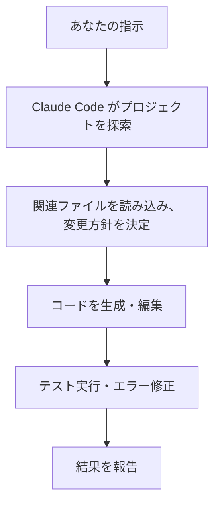
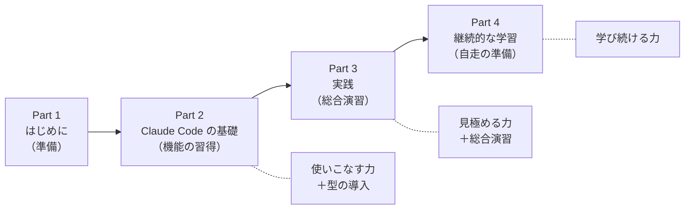

# 1-1-1 Claude Code とは何か

## 🎯 このセクションで学ぶこと

- AI コーディングツールが開発現場にもたらしている変化を理解する
- Claude Code がどのようなツールかを把握する
- この教材で Claude Code を選ぶ理由を理解する
- 教材の全体構成（4 Part / 3層構造 / Section の種類）を最初に把握する

まず開発現場で起きている変化を理解し、次に Claude Code の特徴と選ばれる理由を学び、最後にこの教材を進めるための「地図」（4 Part の役割と3層構造）を頭に入れます。

---

## 導入: 開発現場で起きている変化

COACHTECH の選抜試験を突破し、フリーランスエージェントに所属しているあなたは、これから企業に紹介され、実務開発に携わっていくことになります。

実務に入ると、スクールの課題とは異なる壁にぶつかります。コードベースは数万行、数十万行の規模になり、仕様書を読み解きながら既存のコードに手を入れる必要があります。「どこから読めばいいかわからない」「この変更が他の機能に影響しないか不安」。こうした悩みは、ジュニアエンジニアなら誰もが経験するものです。

一方、開発の現場では AI コーディングツールの導入が急速に進んでいます。GitHub Copilot、Cursor、そして Claude Code。これらのツールは、コード補完にとどまらず、バグの原因調査、リファクタリングの提案、テストコードの生成まで幅広く支援してくれます。

重要なのは、AI ツールの普及が採用市場にも影響を及ぼしているという事実です。一人のエンジニアが AI を活用して高い生産性を発揮できるようになった結果、企業はより少ない人数で開発を回せるようになりました。Stack Overflow の 2025 年の記事「[AI vs Gen Z: How AI has changed the career pathway for junior developers](https://stackoverflow.blog/2025/12/26/ai-vs-gen-z/)」によると、エンジニアリングリーダーの 54% が AI コパイロットの導入を理由にジュニアの採用数を減らす計画だと回答しています。採用のハードルは上がり、ジュニアエンジニアには以前よりも高いバリューが求められるようになっています。

つまり、AI コーディングツールを使いこなせるかどうかは、もはや「便利かどうか」の問題ではありません。実務で成果を出すための前提条件になりつつあります。

### 🧠 先輩エンジニアはこう考える

> 自分がジュニアの頃は「AI なんてまだ先の話」と思っていました。ところが、現場で AI コーディングツールが当たり前になった途端、コードを書くスピードだけでなく、設計判断の質まで変わり始めました。
>
> たとえば、慣れないライブラリの使い方を調べるのに以前は半日かかっていたのが、Claude Code に「このプロジェクトで○○を実装するならどう書く？」と聞くだけで、既存コードの規約に沿った実装案が返ってくる。もちろん、その提案をそのまま採用していいかを判断するのは自分です。でも「ゼロから調べる時間」が圧倒的に減ったことで、設計を考える時間やレビューの質に回せる余裕が生まれました。
>
> ジュニアのうちから AI ツールを正しく使えると、「コードを書ける人」ではなく「質の高いソフトウェアを届けられる人」として評価されやすくなります。逆に言えば、AI ツールを使えない状態で現場に入ると、周囲とのスピード差に苦しむことになるかもしれません。

---

## なぜ「Claude Code」なのか

### AI コーディングツールの進化

AI をコーディングに活用する方法は、ここ数年で大きく進化してきました。あなたも ChatGPT にコードの書き方を聞いたことがあるかもしれません。あの「チャットで相談する」スタイルから、AI がプロジェクト全体を自律的に操作するスタイルへと、ツールの形は急速に変化しています。

以下の表は、AI コーディングツールを **人間の関与度** で分類したものです。下に行くほど AI の自律性が高くなり、人間の役割が「コードを書く」から「判断する・検証する」に変わっていきます。

| カテゴリ | 代表的なツール | 人間の役割 |
|---|---|---|
| チャット型 | ChatGPT、Claude.ai | コードを貼り付けて相談し、回答を手動で反映する |
| 補完型 | GitHub Copilot | IDE 内で AI の提案を採用するか判断する。作業の主体は人間 |
| AI ネイティブ IDE | Cursor、Windsurf | 専用 IDE 内で対話しながらタスクを指示し、AI の編集を確認する |
| ターミナルエージェント | **Claude Code** | **ターミナルからタスクを委任し、AI の出力を検証する** |
| 完全自律型 | Devin | 要件を渡し、成果物を評価する（2026年3月時点では発展途上） |

> 📝 AI コーディングツールの分野は急速に進化しており、各ツールの機能差は日々変わっています。上記の整理は 2026年3月時点のものです。

### この教材で Claude Code を選ぶ理由

どのツールも強力ですが、この教材では Claude Code を採用します。理由は3つです。

**エージェント型として設計されていること**

補完型ツール（GitHub Copilot など）は、コードの「次の行」を提案してくれますが、作業の主体はあなた自身です。Claude Code はエージェント型として最初から設計されており、「認証機能のテストを書いて、実行して、失敗したら修正して」のようにタスク全体を委任できます。

**ターミナルネイティブであること**

Cursor や Windsurf は専用 IDE、GitHub Copilot は IDE プラグインとして動作します。Claude Code はターミナルで動作するため、Git、Docker、テストコマンドなど既存の開発ワークフローにそのまま組み込めます。VS Code や JetBrains の IDE 拡張も提供されていますが、この教材ではすべての機能にアクセスでき開発環境に依存しないターミナルでの使用を基本とします。

**コードベース全体を理解すること**

Claude Code はプロジェクト内のファイルを自由に探索します。特定のファイルを指定しなくても、関連するモデル、コントローラ、テスト、設定ファイルを横断的に読み取ったうえで回答します。大規模なコードベースを扱う実務において、これは特に重要です。

> 📝 この教材で重視するのは、特定のツールに詳しくなることではなく、AI コーディングツールを正しく活用するための「考え方」を身につけることです。Claude Code で身につけた思考法は、将来別のツールを使うことになっても応用できます。

## Claude Code とは何か

では、Claude Code は具体的に何をしてくれるのか。一言で言えば、**あなたの指示をもとに、プロジェクト全体を探索・理解したうえで、コーディング作業を自律的に遂行するツール** です。

Claude Code は以下のような場面で力を発揮します。

- **バグ修正**: エラーメッセージを渡すだけで、原因を特定し修正案を提示する
- **機能開発**: 自然言語で要件を伝えると、複数ファイルにまたがる実装を行う
- **リファクタリング**: 既存コードの改善点を指摘し、安全に書き換える
- **コードリーディング**: 大規模なコードベースの構造や処理の流れを解説する
- **Git 操作**: コミットメッセージの生成、ブランチ作成、PR の作成を行う

ここまでで「Claude Code が何者か」のイメージは掴めたはずです。次にこの教材全体の地図を見て、あなたがこれからどんな道のりを歩むかを把握しましょう。

---

## 教材の全体構成

この教材は4つの Part で構成されています。それぞれの Part は、後ほど [1-1-3 この教材で養う3つの能力](1-1-3_この教材で養う3つの能力.md) で詳しく紹介する3つの能力（使いこなす力・見極める力・学び続ける力）に対応しています。

### Part 1: はじめに（現在地）

教材の導入パートです。Claude Code を学ぶ意義、必要な思考力、教材で養う能力、対象読者を確認し、プラン契約と AI 利用ポリシーの確認まで完了させます。ハンズオンはありません。

### Part 2: Claude Code の基礎

Claude Code の主要機能を習得するパートです。3つの Chapter で構成されています。

- **Chapter 2-1**: セットアップ。インストールと認証を行い、権限やモデル選択、CLAUDE.md の設定まで、自分のプロジェクトで手を動かしながら基盤を整えます
- **Chapter 2-2**: 基本を理解する。Claude Code の仕組みと基本概念を学びます。エージェントループ、コンテキスト管理、プロンプト設計など、使いこなすための土台を固めながら、cc-practice（Part 2 で作成する学習用の Laravel Sail プロジェクト）で実際に体験します
- **Chapter 2-3**: 機能を使いこなす。cc-practice で Claude Code の各機能（Plan Mode、Skills、Hooks、MCP など）を実践的に体験します

### Part 3: Claude Code の実践

既存プロジェクトで実務タスクを遂行するパートです。提供する CourseHub プロジェクトを題材に、バグ修正、機能開発、リファクタリングなどの実務タスクを Claude Code と協働して完了させます。Part 2 で個別に学んだ機能を組み合わせ、タスクの要件理解からコードレビュー、PR 作成まで一気通貫で実践します。

### Part 4: 継続的な学習

学習を習慣化するためのパートです。公式ドキュメントの読み方、新機能の検証方法、情報収集のチャネルなど、この教材を終えた後も自力で成長を続けるための指針を示します。ハンズオンはありません。

---

## 3層構造: Part / Chapter / Section

教材は **Part > Chapter > Section** の3層で構成されています。

- **Part**: 大きなテーマのまとまり。教材全体で4つ
- **Chapter**: Part 内のトピックの区切り。複数の Section で構成される
- **Section**: 学習の最小単位。1つのセクションで1つのテーマを扱う

Section には3つの種類があります。

| 種類 | 内容 | 手を動かす？ |
|---|---|---|
| **概念** | 機能の意義・仕組み・使い方を解説 | いいえ |
| **ハンズオン** | 概念で学んだ機能を実際に使う | はい |
| **混合** | 概念を学びながらすぐに手を動かす | はい |

ハンズオンセクションと混合セクションでは、コードが生成されるたびに **「見極めチェック」** を行います。これは、生成コードを正しさ・品質・安全性の3つの観点で検証するプロセスです。Part 2 から導入し、繰り返し実践することで、AI の出力を自分の判断で採用する習慣を身につけます。

## セクションの読み方

各セクションは共通のフォーマットで書かれています。以下の要素を意識しながら読み進めてください。

| 要素 | 意味 |
|---|---|
| 🎯 **このセクションで学ぶこと** | セクションのゴール。読み終わった後に達成できているか確認する |
| 💡 **TIP** | TIP・補足・実務知見。知っておくと便利だが、必須ではない |
| ⚠️ **注意事項** | つまずきやすいポイント。必ず目を通す |
| 📝 **ノート** | 定義や補足説明。理解を深めるための情報 |
| 🔑 **キーポイント** | 特に重要な概念。確実に理解しておく |
| 🏃 **実践** | 手を動かすパート。指示に沿って操作する |
| 🔍 **見極めチェック** | 生成コードを3つの観点で検証するチェックリスト |
| 🧠 **先輩エンジニアはこう考える** | 実務経験に基づいた考え方やアドバイス |
| ✨ **まとめ** | セクションの要点の振り返り |

---

## ✨ まとめ

- AI コーディングツールの普及により、ジュニアエンジニアにも高い生産性が求められる時代になっている
- Claude Code はエージェント型・ターミナルネイティブ・コードベース全体を理解する AI コーディングツール。実務のワークフローにそのまま組み込める
- 教材は Part 1（はじめに）→ Part 2（基礎）→ Part 3（実践）→ Part 4（継続的な学習）の4部構成
- Part > Chapter > Section の3層構造。Section には概念・ハンズオン・混合の3種類があり、コード生成時には「見極めチェック」を行う

---

次のセクションでは、AI との協働で求められる「具体と抽象の行き来」という思考力を、Laravel の例で掘り下げます。
