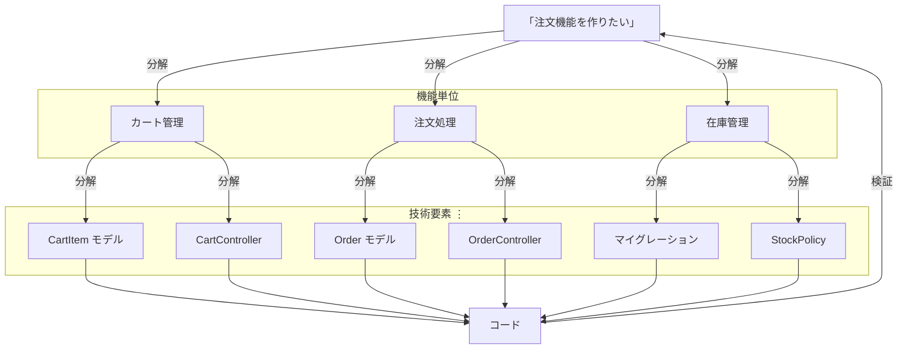

# 1-1-2 AI との協働に求められる思考力

## 🎯 このセクションで学ぶこと

- 「AI に頼ると考えなくなる」という誤解を解く
- AI との協働の核となる「具体と抽象の行き来」を理解する
- ピラミッドモデルを通じて、ゴール → 機能 → 技術要素 → コードへの分解の流れを掴む
- Laravel の例で、分解の粒度によって AI の出力品質がどう変わるかを体感する

まず AI との協働で本当に求められる思考力とは何かを問い直し、次にそれをピラミッドで可視化し、最後に Laravel の注文機能を題材に3パターンの指示を比較します。

---

## 導入: 「AI に頼ると考えなくなる」は本当か

「AI に頼ると自分で考えなくなる」。AI コーディングツールに対して、そんな批判を耳にすることがあります。しかし実態はむしろ逆です。AI がコードの実装を引き受けるようになった結果、人間には「なぜこれをやるのか」「何を作ればいいのか」という、より本質的な思考が求められるようになっています。

考えてみてください。AI に「いい感じに認証機能を作って」と頼んでも、出てくるコードはあなたのプロジェクトの規約や要件にぴったり合うとは限りません。むしろ、ゴールが曖昧であればあるほど、AI は無難で当たり障りのない実装を返してきます。良い結果を引き出すには、ゴールを明確にし、必要な要素を漏れなく構造化して伝える能力が不可欠です。

つまり AI は、考える行為を肩代わりしてくれるのではなく、**考える対象を「コードの書き方」から「何を・なぜ作るか」へと押し上げる** ツールだと言えます。

### 🧠 先輩エンジニアはこう考える

> AI を使い始めてから、自分の思考がどれだけ曖昧だったかに気づかされました。以前は「なんとなくこういう機能が必要」という状態でコードを書き始めて、書きながら考えていた。でも AI に任せるとなると、「なんとなく」では通用しない。何が必要で、何が不要で、どこまでをスコープにするか。それを事前に言語化しないと、AI は見当違いの方向に走ってしまう。
>
> つまり、AI を使うほど「具体を理解して、抽象的に構造化する」力が鍛えられるんです。これは AI がなくなっても残る力で、設計書を書くとき、チームメンバーに説明するとき、要件を整理するとき、すべてに通じます。

---

## 具体と抽象の行き来: ピラミッドで見る

では、AI との協働で求められる「思考」とは具体的に何か。その核にあるのが **具体と抽象の行き来** です。

AI は抽象的な指示を具体のコードに高速で変換します。しかし、その指示を漏れなく構造化するには、具体的なコードやシステムへの深い理解が前提になります。この関係をピラミッドで表すと、次のようになります。



ピラミッドの頂点にある抽象的なゴールを、漏れなく・重複なく分解して中間層を作り、AI がそれを具体的なコードとして実現する。そしてこのサイクルは一度で終わりません。AI が生成した具体的なコードを検証し、新たな課題を見つけ、再び抽象的なレベルで方針を立て直す。この **具体と抽象の行き来を高速に繰り返す** ことが、AI との協働の本質です。

どの層まで自分で分解し、どこから AI に委任するかは固定ではありません。あなたのスキルや経験が深まるほど、また AI の能力が進化するほど、より抽象的なレベルで委任できるようになります。ただし、どのレベルで委任するにしても、AI の出力を検証してゴールと照らし合わせるサイクルは変わりません。

ここで特に重要なのが、層と層をつなぐ **「分解」** のプロセスです。ゴールを具体的な作業に落とし込むとき、漏れなく・重複なく分解できているかどうかで、AI の出力品質が大きく変わります。分解が甘いと、AI は指示の範囲を自分なりに解釈して動くため、想定外の実装が生まれたり、重要なロジックが丸ごと抜け落ちたりします。

---

## Laravel で考えてみよう

具体的な例で見てみましょう。Laravel で EC サイトの「注文機能を作りたい」というゴールがあるとします。ピラミッドの各層に対応させて、3パターンの指示の出し方を比較します。

**抽象のまま丸投げした場合（ピラミッドの頂点だけ）:**

```
> 注文機能を作って。商品をカートに入れて、注文して、在庫を減らせるようにして。
```

この指示では、AI はひとまとめに実装を進めます。結果として以下のような問題が起きやすくなります。

- カートに同じ商品を複数回追加したときの数量処理が曖昧になる
- 注文確定時の在庫チェック（他のユーザーが先に買った場合）が漏れる
- 注文ステータス（未決済・決済済み・発送済み）の状態遷移が未定義のまま実装される
- 権限設計（購入者は自分の注文のみ閲覧、管理者は全件閲覧）が考慮されない

**1段階分解して指示した場合（ピラミッドの中間層まで）:**

```
> 注文機能を作ります。以下の3つの領域に分けて、順番に実装してください。
>
> 1. カート管理: 商品をカートに追加・削除する。数量変更に対応する
> 2. 注文処理: カートの内容を注文として確定する。在庫不足時はエラーを返す
> 3. 在庫管理: 注文確定時に在庫を減らす。管理者のみ在庫数を閲覧できる
>
> まずカート管理から始めてください。
```

頂点のゴールを3つの領域に分解し、それぞれの要件を明示しています。AI はこの構造に沿って「カート管理」から順に実装を進められます。数量処理、在庫チェック、権限設計といった重要な要素も指示に含まれているため、漏れにくくなります。

このように、1段階分解するだけでも AI の出力は大きく改善します。さらに、ここから各領域をより具体的なタスクに分解していくこともできます。

**さらに具体化した場合（ピラミッドの下層まで）:**

```
注文機能
├── カート管理
│   ├── CartItem モデルと cart_items テーブルを作成する
│   ├── CartController で追加・削除・数量変更を処理する
│   └── カート画面で合計金額を表示する
│
├── 注文処理
│   ├── Order / OrderItem モデルを作成する
│   ├── OrderController@store でカート→注文の変換を行う
│   └── 注文確定時にカートをクリアする
│
└── 在庫管理
    ├── products テーブルに stock カラムを追加する
    ├── 注文確定時に在庫を減算する（在庫不足なら例外を投げる）
    └── Policy で管理者のみ在庫閲覧可能にする
```

ここまで分解するには、Laravel の Eloquent リレーション、Controller の責務、Policy による認可といった**具体的な知識** が必要です。具体を知っているからこそ、適切な粒度で分解できるのです。

> 💡 実務では、いきなり最下層まで分解する必要はありません。まず1段階分解して AI に渡し、出力を見てから次の分解に進むというサイクルが自然です。この教材でも、この段階的な進め方を実践していきます。

---

## ✨ まとめ

- AI コーディングツールは「考えなくなる」のではなく、考える対象を「コードの書き方」から「何を・なぜ作るか」へと押し上げる
- 具体と抽象の行き来こそが AI との協働の本質。ゴール → 機能 → 技術要素 → コードへ分解し、出力を検証してまた抽象に戻すサイクルを回す
- 分解の粒度が AI の出力品質を決める。具体を深く理解しているほど、適切な粒度でゴールを構造化できる

---

次のセクションでは、この「具体と抽象の行き来」を支える3つの能力を紹介し、教材のカリキュラム全体がどうそれを養っていくかを示します。
