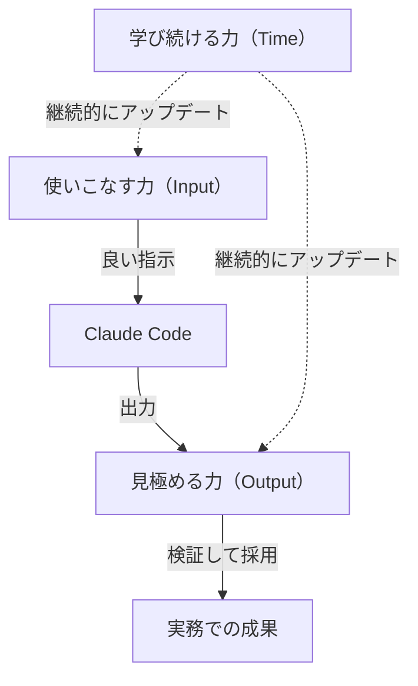

# 1-1-3 この教材で養う3つの能力

## 🎯 このセクションで学ぶこと

- Claude Code を「ただ使う」だけでは実務で成果が出ない理由を理解する
- この教材で養う3つの能力（使いこなす力・見極める力・学び続ける力）を理解する
- それぞれの能力が前のセクションで学んだ「具体と抽象の行き来」をどう支えるかを把握する
- 教材のカリキュラムがどの能力にどう対応しているかを掴む

まず「使うだけ」のリスクを確認し、次に3つの能力を1つずつ掘り下げ、最後にカリキュラム全体との対応関係を整理します。

---

## 導入: 「使えるだけ」では足りない

Claude Code は強力なツールですが、ただ使うだけでは実務で成果は出せません。AI が生成したコードをそのまま本番環境にデプロイして障害を起こしたり、ツールの制約を理解せずに非効率な使い方を続けたりするリスクがあります。

たとえば、AI が生成した SQL クエリが N+1 問題を引き起こしていたり、認可チェックを忘れていたりするケースは珍しくありません。コードはエラーなく動作するため、テストもパスしてしまうかもしれません。しかし本番投入後、パフォーマンス障害や情報漏洩につながる可能性があります。「動くこと」と「正しいこと」「安全なこと」は別物です。

また、ツールの進化スピードにも注意が必要です。半年前に学んだベストプラクティスが、今では古くなっていることもよくあります。一度学んで終わりではなく、変化に追従し続ける姿勢が前提になります。

### 🧠 先輩エンジニアはこう考える

> AI が出してくるコードを最初は丸呑みしていた時期がありました。動くから安心していたんです。でもある日、レビューで「この処理、ユーザー A のデータがユーザー B に見える可能性があるけど大丈夫？」と指摘されて青ざめた。AI は「動くコード」は出してくれるけど、「自分のプロジェクトの文脈で正しいコード」を出すかどうかは別問題なんですよね。それ以来、生成されたコードは必ず自分の言葉で説明できるレベルまで読むようにしています。

---

## 3つの能力

この教材では、Claude Code を実務で正しく活用するために、3つの能力を段階的に養います。これらは、前のセクションで述べた「具体と抽象の行き来」を支える能力でもあります。

### 1. 使いこなす力（Input）

Claude Code の機能、設定、制約を把握し、目的に応じて的確に活用する力です。プロンプトの書き方、CLAUDE.md による指示の与え方、MCP（Model Context Protocol）を使った外部ツール連携など、「何ができて、何ができないか」を正確に把握し、場面に応じて最適な使い方を選択します。

ピラミッドで言えば、ゴールを構造化して AI に伝える **抽象から具体への橋渡し** を担う力です。同じゴールでも、Plan Mode を使うか、Skills を呼ぶか、Sub-agent に委任するかで、出力の質と速度は大きく変わります。「どの引き出しから何を取り出すか」を判断できるようになることが、このスキルのゴールです。

### 2. 見極める力（Output）

AI が生成したコードを、正しさ・品質・安全性の3つの観点で検証し、責任を持って採用する力です。Claude Code が生成するコードは多くの場合そのまま動作しますが、「動くこと」と「正しいこと」は違います。

- **正しさ**: 要件を満たしているか。仕様の解釈にズレはないか
- **品質**: コーディング規約に沿っているか。読みやすく、保守しやすいか
- **安全性**: セキュリティ上の問題はないか。認可・バリデーション・SQL/XSS 対策に漏れはないか

ピラミッドで言えば、AI が出力した具体を抽象的な要件と照らし合わせる **具体の検証** を担う力です。この教材では、コードが生成されるたびに「見極めチェック」を実施し、3観点での検証を習慣にします。

### 3. 学び続ける力（Time）

ツールや技術の進化を追い、自ら試し、実務に適応し続ける力です。AI コーディングツールは急速に進化しており、この教材で学んだ知識が半年後にはそのまま通用しない可能性もあります。公式ドキュメントを読む習慣、新機能を自分で試す姿勢、変化に適応する柔軟性が重要です。

ツールの進化に伴い **ピラミッドそのものが変化し続ける** 中で、使いこなす力と見極める力をアップデートし続ける土台になります。具体的には、公式ドキュメントの読み方、リリースノートの追い方、コミュニティ情報の取捨選択、自分のワークフローへの組み込み方などを Part 4 で扱います。

---

## 3つの能力の関係

この3つの能力は相互に支え合っています。

使いこなす力がなければ良い出力は得られず、見極める力がなければ出力を信頼できず、学び続ける力がなければ他の2つの能力も陳腐化します。どれか1つだけを伸ばしても実務では成果につながりません。

## カリキュラムとの対応

教材の各 Part は、これら3つの能力に対応する形で設計されています。

| Part | 主に養う能力 | 学ぶこと |
|---|---|---|
| Part 1: はじめに | （準備） | 教材の地図、思考力、3つの能力、対象読者の確認 |
| Part 2: Claude Code の基礎 | **使いこなす力** + 見極める力の型の導入 | 主要機能の習得（セットアップ → 基本理解 → 機能実践） |
| Part 3: Claude Code の実践 | **見極める力** + 使いこなす力の総合演習 | CourseHub で実務タスクを遂行 |
| Part 4: 継続的な学習 | **学び続ける力** | 学習サイクルの習慣化と発展機能の紹介 |

> 🔑 Part 2 で「使いこなす力」の土台を作り、Part 3 で「見極める力」を実務タスクで磨き、Part 4 で「学び続ける力」を身につける。この順番で進めることで、3つの能力が無理なく積み上がっていくように設計されています。

---

## ✨ まとめ

- Claude Code は強力だが、「動くコード」と「自分のプロジェクトで正しいコード」は別物。検証と継続学習が前提になる
- この教材では「使いこなす力（Input）」「見極める力（Output）」「学び続ける力（Time）」の3つの能力を段階的に養う
- 3つの能力は相互に支え合っており、どれか1つだけでは実務で成果につながらない
- 教材の各 Part はこの3つの能力に対応するように設計されている

---

次のセクションでは、ここまで紹介してきた教材の対象読者を改めて明確にし、学習に必要な前提知識と環境を確認します。
