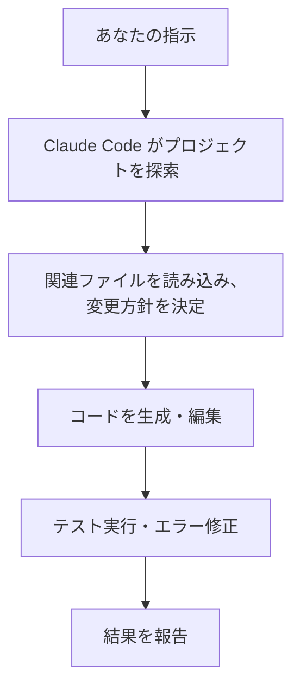
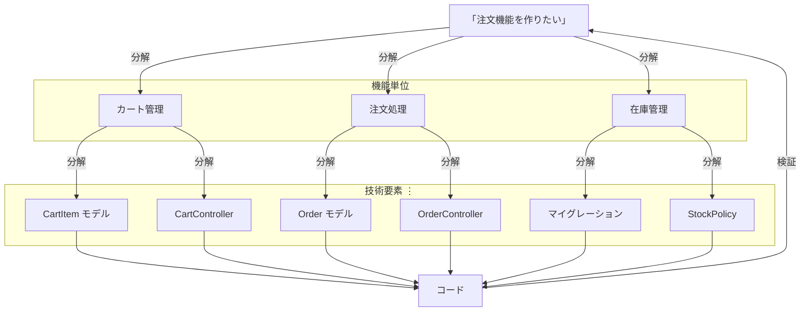

# 1-1-1 なぜ Claude Code を使うのか

> Claude Code を学ぶ意義と教材の全体像を理解し、自分に適した学習計画を立てるための導入 Chapter です。「なぜ今これを学ぶのか」を腹落ちさせ、迷いなく学習を始められる状態を目指します。

| セクション | 種類 | 内容 |
|---|---|---|
| 1-1-1 | 概念 | AI 時代にジュニアエンジニアが Claude Code を学ぶ意義、AI との協働に求められる思考力、この教材で養う3つの能力 |
| 1-1-2 | 概念 | この教材の対象読者と、学習を始めるために必要な前提知識・環境 |
| 1-1-3 | 概念 | 教材の全体構成と、自分に適した学習の進め方 |

## 📖 この Chapter の進め方

この Chapter はすべて概念セクションです。手を動かす作業はありません。読みながら「自分がこの教材で何を得られるか」を整理してください。

---

## 🎯 このセクションで学ぶこと

- AI コーディングツールが開発現場にもたらしている変化を理解する
- Claude Code がどのようなツールかを把握する
- AI との協働で求められる思考力（具体と抽象の行き来）を理解する
- この教材で養う3つの能力（使いこなす力・見極める力・学び続ける力）を理解する

まず開発現場で起きている変化を理解し、次に Claude Code の特徴と選ばれる理由を学びます。その後、AI との協働に求められる思考力を掘り下げ、最後にこの教材で養う3つの能力を把握します。

---

## 導入: 開発現場で起きている変化

COACHTECH の選抜試験を突破し、フリーランスエージェントに所属しているあなたは、これから企業に紹介され、実務開発に携わっていくことになります。

実務に入ると、スクールの課題とは異なる壁にぶつかります。コードベースは数万行、数十万行の規模になり、仕様書を読み解きながら既存のコードに手を入れる必要があります。「どこから読めばいいかわからない」「この変更が他の機能に影響しないか不安」。こうした悩みは、ジュニアエンジニアなら誰もが経験するものです。

一方、開発の現場では AI コーディングツールの導入が急速に進んでいます。GitHub Copilot、Cursor、そして Claude Code。これらのツールは、コード補完にとどまらず、バグの原因調査、リファクタリングの提案、テストコードの生成まで幅広く支援してくれます。

重要なのは、AI ツールの普及が採用市場にも影響を及ぼしているという事実です。一人のエンジニアが AI を活用して高い生産性を発揮できるようになった結果、企業はより少ない人数で開発を回せるようになりました。Stack Overflow の 2025 年の記事「[AI vs Gen Z: How AI has changed the career pathway for junior developers](https://stackoverflow.blog/2025/12/26/ai-vs-gen-z/)」によると、エンジニアリングリーダーの 54% が AI コパイロットの導入を理由にジュニアの採用数を減らす計画だと回答しています。採用のハードルは上がり、ジュニアエンジニアには以前よりも高いバリューが求められるようになっています。

つまり、AI コーディングツールを使いこなせるかどうかは、もはや「便利かどうか」の問題ではありません。実務で成果を出すための前提条件になりつつあります。

### 🧠 先輩エンジニアはこう考える

> 自分がジュニアの頃は「AI なんてまだ先の話」と思っていました。ところが、現場で AI コーディングツールが当たり前になった途端、コードを書くスピードだけでなく、設計判断の質まで変わり始めました。
>
> たとえば、慣れないライブラリの使い方を調べるのに以前は半日かかっていたのが、Claude Code に「このプロジェクトで○○を実装するならどう書く？」と聞くだけで、既存コードの規約に沿った実装案が返ってくる。もちろん、その提案をそのまま採用していいかを判断するのは自分です。でも「ゼロから調べる時間」が圧倒的に減ったことで、設計を考える時間やレビューの質に回せる余裕が生まれました。
>
> ジュニアのうちから AI ツールを正しく使えると、「コードを書ける人」ではなく「質の高いソフトウェアを届けられる人」として評価されやすくなります。逆に言えば、AI ツールを使えない状態で現場に入ると、周囲とのスピード差に苦しむことになるかもしれません。

---

## なぜ「Claude Code」なのか

### AI コーディングツールの進化

AI をコーディングに活用する方法は、ここ数年で大きく進化してきました。あなたも ChatGPT にコードの書き方を聞いたことがあるかもしれません。あの「チャットで相談する」スタイルから、AI がプロジェクト全体を自律的に操作するスタイルへと、ツールの形は急速に変化しています。

以下の表は、AI コーディングツールを **人間の関与度** で分類したものです。下に行くほど AI の自律性が高くなり、人間の役割が「コードを書く」から「判断する・検証する」に変わっていきます。

| カテゴリ | 代表的なツール | 人間の役割 |
|---|---|---|
| チャット型 | ChatGPT、Claude.ai | コードを貼り付けて相談し、回答を手動で反映する |
| 補完型 | GitHub Copilot | IDE 内で AI の提案を採用するか判断する。作業の主体は人間 |
| AI ネイティブ IDE | Cursor、Windsurf | 専用 IDE 内で対話しながらタスクを指示し、AI の編集を確認する |
| ターミナルエージェント | **Claude Code** | **ターミナルからタスクを委任し、AI の出力を検証する** |
| 完全自律型 | Devin | 要件を渡し、成果物を評価する（2026年3月時点では発展途上） |

> 📝 AI コーディングツールの分野は急速に進化しており、各ツールの機能差は日々変わっています。上記の整理は 2026年3月時点のものです。

### この教材で Claude Code を選ぶ理由

どのツールも強力ですが、この教材では Claude Code を採用します。理由は3つです。

**エージェント型として設計されていること**

補完型ツール（GitHub Copilot など）は、コードの「次の行」を提案してくれますが、作業の主体はあなた自身です。Claude Code はエージェント型として最初から設計されており、「認証機能のテストを書いて、実行して、失敗したら修正して」のようにタスク全体を委任できます。

**ターミナルネイティブであること**

Cursor や Windsurf は専用 IDE、GitHub Copilot は IDE プラグインとして動作します。Claude Code はターミナルで動作するため、Git、Docker、テストコマンドなど既存の開発ワークフローにそのまま組み込めます。VS Code や JetBrains の IDE 拡張も提供されていますが、この教材ではすべての機能にアクセスでき開発環境に依存しないターミナルでの使用を基本とします。

**コードベース全体を理解すること**

Claude Code はプロジェクト内のファイルを自由に探索します。特定のファイルを指定しなくても、関連するモデル、コントローラ、テスト、設定ファイルを横断的に読み取ったうえで回答します。大規模なコードベースを扱う実務において、これは特に重要です。

> 📝 この教材で重視するのは、特定のツールに詳しくなることではなく、AI コーディングツールを正しく活用するための「考え方」を身につけることです。Claude Code で身につけた思考法は、将来別のツールを使うことになっても応用できます。

## Claude Code とは何か

では、Claude Code は具体的に何をしてくれるのか。一言で言えば、**あなたの指示をもとに、プロジェクト全体を探索・理解したうえで、コーディング作業を自律的に遂行するツール** です。



Claude Code は以下のような場面で力を発揮します。

- **バグ修正**: エラーメッセージを渡すだけで、原因を特定し修正案を提示する
- **機能開発**: 自然言語で要件を伝えると、複数ファイルにまたがる実装を行う
- **リファクタリング**: 既存コードの改善点を指摘し、安全に書き換える
- **コードリーディング**: 大規模なコードベースの構造や処理の流れを解説する
- **Git 操作**: コミットメッセージの生成、ブランチ作成、PR の作成を行う

---

## AI との協働に求められる思考力

「AI に頼ると自分で考えなくなる」。AI コーディングツールに対して、そんな批判を耳にすることがあります。しかし実態はむしろ逆です。AI がコードの実装を引き受けるようになった結果、人間には「なぜこれをやるのか」「何を作ればいいのか」という、より本質的な思考が求められるようになっています。

では、AI との協働で求められる「思考」とは具体的に何か。その核にあるのが **具体と抽象の行き来** です。

AI は抽象的な指示を具体のコードに高速で変換します。しかし、その指示を漏れなく構造化するには、具体的なコードやシステムへの深い理解が前提になります。この関係をピラミッドで表すと、次のようになります。



ピラミッドの頂点にある抽象的なゴールを、漏れなく・重複なく分解して中間層を作り、AI がそれを具体的なコードとして実現する。そしてこのサイクルは一度で終わりません。AI が生成した具体的なコードを検証し、新たな課題を見つけ、再び抽象的なレベルで方針を立て直す。この **具体と抽象の行き来を高速に繰り返す** ことが、AI との協働の本質です。

どの層まで自分で分解し、どこから AI に委任するかは固定ではありません。あなたのスキルや経験が深まるほど、また AI の能力が進化するほど、より抽象的なレベルで委任できるようになります。ただし、どのレベルで委任するにしても、AI の出力を検証してゴールと照らし合わせるサイクルは変わりません。

ここで特に重要なのが、層と層をつなぐ **「分解」** のプロセスです。ゴールを具体的な作業に落とし込むとき、漏れなく・重複なく分解できているかどうかで、AI の出力品質が大きく変わります。分解が甘いと、AI は指示の範囲を自分なりに解釈して動くため、想定外の実装が生まれたり、重要なロジックが丸ごと抜け落ちたりします。

### Laravel で考えてみよう

具体的な例で見てみましょう。Laravel で EC サイトの「注文機能を作りたい」というゴールがあるとします。ピラミッドの各層に対応させて、3パターンの指示の出し方を比較します。

**抽象のまま丸投げした場合（ピラミッドの頂点だけ）:**

```
> 注文機能を作って。商品をカートに入れて、注文して、在庫を減らせるようにして。
```

この指示では、AI はひとまとめに実装を進めます。結果として以下のような問題が起きやすくなります。

- カートに同じ商品を複数回追加したときの数量処理が曖昧になる
- 注文確定時の在庫チェック（他のユーザーが先に買った場合）が漏れる
- 注文ステータス（未決済・決済済み・発送済み）の状態遷移が未定義のまま実装される
- 権限設計（購入者は自分の注文のみ閲覧、管理者は全件閲覧）が考慮されない

**1段階分解して指示した場合（ピラミッドの中間層まで）:**

```
> 注文機能を作ります。以下の3つの領域に分けて、順番に実装してください。
>
> 1. カート管理: 商品をカートに追加・削除する。数量変更に対応する
> 2. 注文処理: カートの内容を注文として確定する。在庫不足時はエラーを返す
> 3. 在庫管理: 注文確定時に在庫を減らす。管理者のみ在庫数を閲覧できる
>
> まずカート管理から始めてください。
```

頂点のゴールを3つの領域に分解し、それぞれの要件を明示しています。AI はこの構造に沿って「カート管理」から順に実装を進められます。数量処理、在庫チェック、権限設計といった重要な要素も指示に含まれているため、漏れにくくなります。

このように、1段階分解するだけでも AI の出力は大きく改善します。さらに、ここから各領域をより具体的なタスクに分解していくこともできます。

**さらに具体化した場合（ピラミッドの下層まで）:**

```
注文機能
├── カート管理
│   ├── CartItem モデルと cart_items テーブルを作成する
│   ├── CartController で追加・削除・数量変更を処理する
│   └── カート画面で合計金額を表示する
│
├── 注文処理
│   ├── Order / OrderItem モデルを作成する
│   ├── OrderController@store でカート→注文の変換を行う
│   └── 注文確定時にカートをクリアする
│
└── 在庫管理
    ├── products テーブルに stock カラムを追加する
    ├── 注文確定時に在庫を減算する（在庫不足なら例外を投げる）
    └── Policy で管理者のみ在庫閲覧可能にする
```

ここまで分解するには、Laravel の Eloquent リレーション、Controller の責務、Policy による認可といった**具体的な知識** が必要です。具体を知っているからこそ、適切な粒度で分解できるのです。

> 💡 実務では、いきなり最下層まで分解する必要はありません。まず1段階分解して AI に渡し、出力を見てから次の分解に進むというサイクルが自然です。この教材でも、この段階的な進め方を実践していきます。

### 🧠 先輩エンジニアはこう考える

> AI を使い始めてから、自分の思考がどれだけ曖昧だったかに気づかされました。以前は「なんとなくこういう機能が必要」という状態でコードを書き始めて、書きながら考えていた。でも AI に任せるとなると、「なんとなく」では通用しない。何が必要で、何が不要で、どこまでをスコープにするか。それを事前に言語化しないと、AI は見当違いの方向に走ってしまう。
>
> つまり、AI を使うほど「具体を理解して、抽象的に構造化する」力が鍛えられるんです。これは AI がなくなっても残る力で、設計書を書くとき、チームメンバーに説明するとき、要件を整理するとき、すべてに通じます。

---

## この教材で養う3つの能力

Claude Code は強力なツールですが、ただ使うだけでは実務で成果は出せません。AI が生成したコードをそのまま本番環境にデプロイして障害を起こしたり、ツールの制約を理解せずに非効率な使い方を続けたりするリスクがあります。

この教材では、Claude Code を実務で正しく活用するために、3つの能力を段階的に養います。これらは、先ほど述べた「具体と抽象の行き来」を支える能力でもあります。

### 1. 使いこなす力

Claude Code の機能、設定、制約を把握し、目的に応じて的確に活用する力です。プロンプトの書き方、CLAUDE.md による指示の与え方、MCP（Model Context Protocol）を使った外部ツール連携など、「何ができて、何ができないか」を正確に把握し、場面に応じて最適な使い方を選択します。ピラミッドで言えば、ゴールを構造化して AI に伝える **抽象から分解への橋渡し** を担う力です。

### 2. 見極める力

AI が生成したコードを、正しさ・品質・安全性の3つの観点で検証し、責任を持って採用する力です。Claude Code が生成するコードは多くの場合そのまま動作しますが、「動くこと」と「正しいこと」は違います。要件を満たしているか（正しさ）、コーディング規約に沿っているか（品質）、セキュリティ上の問題がないか（安全性）。ピラミッドで言えば、AI が出力した具体を抽象的な要件と照らし合わせる **具体の検証** を担う力です。この教材では、コードが生成されるたびに「見極めチェック」を実施します。

### 3. 学び続ける力

ツールや技術の進化を追い、自ら試し、実務に適応し続ける力です。AI コーディングツールは急速に進化しており、この教材で学んだ知識が半年後にはそのまま通用しない可能性もあります。公式ドキュメントを読む習慣、新機能を自分で試す姿勢、変化に適応する柔軟性が重要です。ツールの進化に伴い **ピラミッドそのものが変化し続ける** 中で、使いこなす力と見極める力をアップデートし続ける土台になります。

この3つの能力は相互に支え合っています。使いこなす力がなければ良い出力は得られず、見極める力がなければ出力を信頼できず、学び続ける力がなければ他の2つの能力も陳腐化します。

---

## ✨ まとめ

- AI コーディングツールの普及により、ジュニアエンジニアにも高い生産性が求められる時代になっている
- Claude Code はエージェント型の AI コーディングツールで、プロジェクト全体を理解したうえで自律的にコーディング作業を行う
- AI との協働は「考えなくなる」のではなく、具体と抽象を行き来する思考力がより求められる。ゴールを漏れなく構造化し、AI の出力を検証するサイクルを回すことが本質
- この教材では「使いこなす力」「見極める力」「学び続ける力」の3つの能力を養い、具体と抽象の行き来を支える土台を作る

---

次のセクションでは、この教材の対象読者と、学習を始めるために必要な前提知識・環境を確認します。
