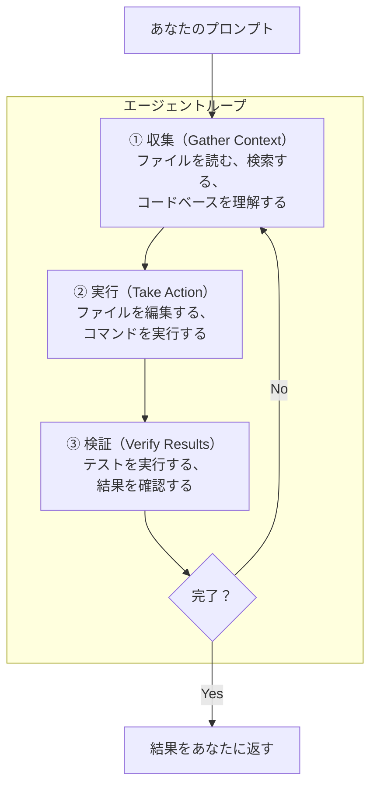

# 2-2-1 エージェントループ

## 🎯 このセクションで学ぶこと

- Claude Code の動作原理（エージェントループ）を理解する
- ループを構成する3つのフェーズ（収集・実行・検証）の役割を知る
- Claude Code が使えるツールの種類と、アクセスできる情報の範囲を把握する

まず Claude Code の動作原理であるエージェントループを理解し、次にループを構成するモデルとツールの役割を学び、最後に実際のプロジェクトでループの動きを観察します。

---

## 導入: Claude Code に指示したあと、何が起きているか

Chapter 2-1 で、あなたは Claude Code にファイルの作成やコードの生成を指示しました。指示を入力して Enter を押すと、Claude Code はしばらく考えてから結果を返してきます。このとき、裏側では何が起きているのでしょうか。

「AI がコードを生成している」という理解では不十分です。Claude Code は単にテキストを生成するだけでなく、**ファイルを読み、コマンドを実行し、結果を確認して次の行動を決める** という一連のプロセスを繰り返しています。この仕組みを理解していないと、「なぜ思った通りの結果にならないのか」「どう指示すれば改善するのか」の判断ができません。

このセクションでは、Claude Code の動作原理である **エージェントループ** を学びます。

### 🧠 先輩エンジニアはこう考える

> エージェントループを知っていると、Claude Code の動きが「予測可能」になる。たとえば「テストを修正して」と指示したとき、Claude Code がまずテストを実行し、エラーを確認し、該当ファイルを読み、修正して、再度テストを実行する、という流れが頭の中でイメージできる。この予測ができると、途中で的外れな方向に進んでいるかどうかを早い段階で判断できるし、「テストを実行して」「エラーを読んで」と1つずつ指示する必要もなくなる。裏側の仕組みを知ることで、ツールの使い方が一段上がる。

---

## エージェントループとは

エージェントループは、Claude Code の中核となる動作モデルです。あなたがプロンプト（指示）を入力すると、Claude Code は **収集（Gather）→ 実行（Act）→ 検証（Verify）** という3つのフェーズを繰り返しながらタスクを完了に導きます。



重要なのは、3つのフェーズが厳密に順番通りに進むわけではない、という点です。Claude Code はタスクに応じてフェーズを柔軟に組み合わせます。

- **質問への回答**: 収集フェーズだけで完了することもある（ファイルを読んで回答する）
- **バグ修正**: 3つのフェーズを何度も繰り返す（テスト実行 → エラー確認 → 修正 → 再テスト）
- **リファクタリング**: 収集に多くの時間を使い、実行と検証を繰り返す

この「状況に応じてループを回し続ける」という振る舞いが、単なるテキスト生成 AI と Claude Code の決定的な違いです。ChatGPT にコードを聞くと1回の応答で終わりますが、Claude Code は目的が達成されるまで自律的に行動し続けます。

### ループの途中で介入できる

エージェントループは自律的に動きますが、完全に放任するわけではありません。**あなたはいつでもループに介入できます。**

Claude Code が作業中に間違った方向に進んでいると感じたら、`Esc` キーを押して中断できます。中断してもそれまでの会話の文脈は保持されるので、「そうじゃなくて、こっちのアプローチで試して」と軌道修正できます。最初からやり直す必要はありません。

この「自律的に動くが、いつでも人間が介入できる」という設計は、Claude Code を使ううえで常に意識しておくべきポイントです。

## エージェントループを動かす2つの要素

エージェントループは、**モデル** と **ツール** の2つの要素で成り立っています。

### モデル: 判断する頭脳

モデル（Claude）は、コードを読み解き、タスクについて考え、次に何をすべきかを判断する役割を担います。プログラミング言語を問わずコードを理解し、コンポーネント間の関係を把握し、目的を達成するために何を変更すべきかを推論します。

Chapter 2-1 で学んだように、Sonnet や Opus など複数のモデルが利用可能で、それぞれ得意分野が異なります。モデルが「考える」部分を担当し、次に説明するツールが「行動する」部分を担当します。

### ツール: 行動する手足

ツールがなければ、Claude Code はテキストで応答することしかできません。ツールがあるからこそ、Claude Code はファイルを読み、コードを編集し、コマンドを実行できる **エージェント** として機能します。

Claude Code には、以下の5つのカテゴリのツールが組み込まれています。

| カテゴリ | Claude Code ができること |
|---|---|
| **ファイル操作** | ファイルの読み取り、コード編集、新規ファイル作成、ファイル名の変更 |
| **検索** | ファイル名のパターン検索、正規表現によるコード内検索、コードベースの探索 |
| **実行** | シェルコマンドの実行、サーバーの起動、テストの実行、Git 操作 |
| **Web** | Web 検索、ドキュメントの取得、エラーメッセージの検索 |
| **コードインテリジェンス** | 型エラーや警告の検出、定義元へのジャンプ、参照の検索 |

> 📝 コードインテリジェンスは他の4つのビルトインツールとは異なり、Code Intelligence Plugin をインストールすることで利用できるオプション機能です（2-3-6 Plugins で紹介します）。今は「こういうカテゴリがある」ことだけ把握しておけば十分です。

各ツールの実行結果は、ループにフィードバックされます。たとえば「テストが失敗している」という結果を受けて、Claude Code は次のアクション（エラーの原因調査）を決定します。この **ツールの実行結果が次の判断材料になる** という仕組みが、エージェントループの核心です。

### 具体例: 「テストを修正して」と指示した場合

エージェントループが実際にどう動くか、具体的な例で見てみましょう。

あなたが「テストが失敗しているから修正して」と指示したとします。Claude Code は以下のような流れで動きます。

```
① 収集: テストを実行して失敗内容を確認する
      │
      ▼
① 収集: エラーメッセージから関連するソースファイルを特定する
      │
      ▼
① 収集: ソースファイルを読んでコードを理解する
      │
      ▼
② 実行: 原因を特定し、ファイルを編集して修正する
      │
      ▼
③ 検証: テストを再実行して修正が正しいか確認する
      │
      ▼
   まだ失敗している → ①に戻る
   すべて通った → 完了
```

注目すべきは、あなたが「テストを実行して」「エラーを読んで」「ファイルを開いて」と1つずつ指示していない点です。「テストを修正して」という1つの指示から、Claude Code が自律的に必要なステップを判断して実行しています。

Claude Code がセッション中にどのツールを使ったかは、ターミナルの出力で確認できます。ファイルの読み取り、コマンドの実行、ファイルの編集といった操作がリアルタイムで表示されます。このログを見る習慣をつけると、Claude Code が今どのフェーズにいるのか、期待通りに動いているのかを判断できるようになります。

> 💡 ログの詳細度は `Ctrl+O` で切り替えられます。Verbose モードにすると、ツールの実行内容がより詳しく表示されます。

## Claude Code の「視界」: 何にアクセスできるか

エージェントループが効果的に動くためには、Claude Code がプロジェクトの情報にアクセスできる必要があります。`claude` コマンドでセッションを開始すると、Claude Code は以下の情報にアクセスできるようになります。

**プロジェクトのファイル**

カレントディレクトリとそのサブディレクトリにあるファイルを読み書きできます。あなたの許可があれば、それ以外の場所のファイルにもアクセスできます。

**ターミナル**

あなたがターミナルで実行できるコマンドは、Claude Code も実行できます。ビルドツール、Git、パッケージマネージャー、システムユーティリティなど、コマンドラインからできることはすべて可能です。

**Git の状態**

現在のブランチ、コミットされていない変更、直近のコミット履歴を把握しています。

**CLAUDE.md**

Chapter 2-1 で設定した CLAUDE.md の内容は、毎回のセッション開始時に読み込まれます。

**自動メモリ**

セッション中に Claude Code が学習した内容（プロジェクトのパターン、あなたの好みなど）も参照されます。

**拡張機能**

MCP サーバー、Skills、Sub-agents など、設定した拡張機能も利用できます。これらは Claude Code の振る舞いを後から拡張するための仕組みで、次の Chapter 2-3 で1つずつ学んでいきます。今は「ビルトインのツールに加えて、後から差し込める拡張機能の口がある」ことだけ押さえれば十分です。

この「視界」の広さが、Claude Code の強みです。ファイル補完型の AI アシスタント（エディタに組み込まれた AI 機能など）が今開いているファイルしか見えないのに対し、Claude Code はプロジェクト全体を見渡せます。「認証のバグを修正して」と指示すれば、関連ファイルを探し、複数のファイルを横断的に読み、整合性を取りながら修正できるのはこのためです。

---

## 🏃 実践: エージェントループを観察する

ここまで学んだエージェントループの仕組みを、cc-practice で実際に観察してみましょう。ここからは cc-practice に簡単な **日報管理機能** を少しずつ作りながら、Claude Code の各機能を体験していきます。今回はその最初のステップとして、日報モデルを作成する過程でエージェントループがどう動くかを観察します。

### Step 1: ログの詳細度を上げる

cc-practice で Claude Code を起動します。

```bash
claude
```

`Ctrl+O` を押してログの詳細度を Verbose モードに切り替えてください。ツールの実行内容がより詳しく表示されるようになります。

### Step 2: タスクを依頼してループを観察する

以下の指示を出してください。指示を出したら、**結果が返ってくるまでターミナルの出力をじっくり観察してください。**

```
> app/Models に DailyReport モデルと、対応するマイグレーションファイルを作成して。date（日付）、title（文字列）、content（テキスト）、status（文字列、デフォルト値 'draft'）のカラムを持つようにして
```

Claude Code がタスクを実行している間、ターミナルにツールの実行ログが流れます。以下のような流れが観察できるはずです。

```
① 収集: 既存のモデルやマイグレーションの構造を確認する
         （Read でファイルを読む、Glob でファイルを検索する）
         ↓
② 実行: DailyReport モデルとマイグレーションファイルを作成する
         （Write でファイルを書き込む）
         ↓
③ 検証: 作成したファイルの内容を確認する
         （Read で作成したファイルを読み直す）
```

> 📝 あなたの環境では、ツールの実行順序や回数が異なる場合があります。重要なのは「収集 → 実行 → 検証」の大きな流れを掴むことです。

### Step 3: 成果物を確認する

タスクが完了したら、作成されたファイルを確認しましょう。

```bash
! ls app/Models/
! ls database/migrations/
```

`DailyReport.php` モデルと、タイムスタンプ付きのマイグレーションファイルが作成されているはずです。

### Step 4: マイグレーションを実行する

作成されたマイグレーションを実際に実行して、テーブルが作られることを確認しましょう。

> 📌 Sail が起動していない場合は、先に `./vendor/bin/sail up -d` を実行してください。前のセッションから時間が経っている場合や、マシンを再起動した場合は Docker コンテナが停止していることがあります。

```
> Sail でマイグレーションを実行して
```

Claude Code が `./vendor/bin/sail artisan migrate` を実行します。ここでも権限確認のダイアログが表示されるので、「Allow」を選択してください。

> 💡 ここでの観察ポイントは、Claude Code が CLAUDE.md のルール（Sail 経由でコマンドを実行する）を守っているかどうかです。`php artisan migrate` ではなく `./vendor/bin/sail artisan migrate` を使っていれば、CLAUDE.md が正しく機能しています。

### Step 5（任意）: phpMyAdmin でテーブルを確認する

受講中教材で phpMyAdmin を使っていた方は、cc-practice にも追加するとテーブルの状態を視覚的に確認できて便利です。

```
> compose.yaml に phpMyAdmin サービスを追加して。ポートは 8080 で、mysql サービスに接続する構成にして
```

Claude Code が `compose.yaml` を編集します。編集後、コンテナを再起動します。

```
> Sail を再起動して
```

ブラウザで `http://localhost:8080` にアクセスし、phpMyAdmin が表示されることを確認してください。ユーザー名は `sail`、パスワードは `password` です（`.env` の `DB_USERNAME` / `DB_PASSWORD` と同じ）。

`daily_reports` テーブルが作成されていることを phpMyAdmin 上で確認できるはずです。

> 📝 phpMyAdmin の追加は任意です。追加しなくてもこの教材の学習に支障はありません。Claude Code から `sail artisan tinker` や SQL を実行してテーブルを確認する方法もあります。

---

## 🔍 見極めチェック

> 🧠 先輩エンジニアの思考: 「エージェントループを観察した直後だからこそ、生成されたコードも自分の目で確認しよう。Claude Code がループの中で何を判断し、どんなコードを書いたのかを検証する習慣は、ここから始めよう。」

Step 2 で生成された DailyReport モデルとマイグレーションファイルを確認しましょう。

- [ ] **正しさ**: マイグレーションに `date`、`title`、`content`、`status` の4カラムが定義されているか。`status` のデフォルト値が `'draft'` になっているか
- [ ] **品質**: モデルの `$fillable` に適切なカラムが指定されているか。`$casts` で `date` カラムに型キャストが設定されているか
- [ ] **安全性**: この段階では安全性に関する特別な懸念はありません

> 🔑 この Section では特に「正しさ」に注目してください。指示した内容が正確に反映されているかを確認することが、見極めの第一歩です。

---

## ✨ まとめ

- Claude Code は **エージェントループ**（収集 → 実行 → 検証の繰り返し）で動作する。単なるテキスト生成ではなく、自律的に行動し続ける
- ループは **モデル**（判断）と **ツール**（行動）の2つの要素で構成される
- ツールは5カテゴリ（ファイル操作・検索・実行・Web・コードインテリジェンス）に分かれ、各実行結果が次の判断材料になる
- あなたはループの途中でいつでも介入（`Esc` で中断、軌道修正）できる
- Claude Code はプロジェクト全体を「視界」に収めており、複数ファイルを横断的に扱える

---

次のセクションでは、エージェントループが動作する「場」であるコンテキストウィンドウについて学びます。コンテキストの管理は、Claude Code を効果的に使うための最も重要なスキルです。
