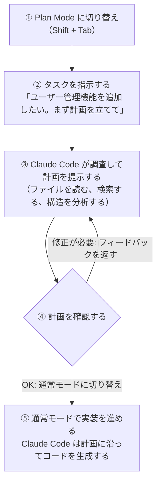

# 2-3-1 Plan Mode

## 🎯 このセクションで学ぶこと

- 計画と実装を分離する意義を理解する
- Plan Mode の起動方法と操作方法を覚える
- 計画を立ててから実装に移る一連の流れを体験する

まず計画と実装を分離する意義を理解し、次に Plan Mode の起動方法と操作の流れを学び、最後に cc-practice で計画から実装までを一通り体験します。

---

## 導入: 「とりあえず作って」で何が起きるか

Chapter 2-2 で学んだプロンプト設計の原則3「探索と実装を分離する」を覚えていますか。Claude Code に「ユーザー管理機能を作って」とだけ指示すると、Claude Code はすぐにコードを書き始めます。ファイルを次々と生成し、テストを書き、実行する。一見スムーズに見えますが、途中で「あれ、この設計で大丈夫だろうか」と気づいたときには、もう大量のコードが生成された後です。

問題は2つあります。

1つ目は **方向性のズレに気づくのが遅い** こと。Claude Code が自律的に実装を進めるため、あなたが「認証は Fortify を使いたかった」「テーブル設計が想定と違う」と気づいたときには、修正のコストが大きくなっています。

2つ目は **コンテキストの浪費** です。Chapter 2-2 で学んだように、コンテキストウィンドウには上限があります。「とりあえず実装→やり直し」を繰り返すと、失敗した試行錯誤がコンテキストを埋め尽くし、本来の実装に使える余裕がなくなります。

これらの問題を解決するのが **Plan Mode** です。

### 🧠 先輩エンジニアはこう考える

> 実務でも「設計レビューなしにいきなりコードを書き始める」のは危険だ。特に経験が浅いうちは、自分では正しいと思った方向が実は要件とずれていた、ということがよくある。Plan Mode はまさに「実装前のレビュー」をClaude Code との間で行う仕組み。自分が「これから何を作るのか」を言語化して確認するプロセスは、AI ツールに限らず開発の基本中の基本だ。

---

## Plan Mode とは

Plan Mode は、Claude Code に **「調べるだけで、コードは書かない」** モードに切り替える機能です。Plan Mode に入ると、Claude Code はファイルの読み取りや検索はできますが、ファイルの編集やコマンドの実行はできなくなります。つまり、コードベースを調査して計画を立てることに専念します。

```
通常モード                          Plan Mode
┌─────────────────────┐      ┌─────────────────────┐
│ ファイル読み取り ✅  │      │ ファイル読み取り ✅  │
│ コード検索     ✅   │      │ コード検索     ✅   │
│ ファイル編集   ✅   │      │ ファイル編集   ❌   │
│ コマンド実行   ✅   │      │ コマンド実行   ❌   │
│ 新規ファイル作成 ✅ │      │ 新規ファイル作成 ❌ │
└─────────────────────┘      └─────────────────────┘
     調査＋実装                    調査のみ
```

Plan Mode では、Claude Code はコードベースを探索し、以下のような **計画** を提示します。

- どのファイルを変更するか
- どのような設計アプローチを取るか
- どのような順番で実装するか
- 注意すべきポイントは何か

あなたはこの計画を確認し、問題があればフィードバックを返します。計画に納得できたら通常モードに切り替えて、その計画に沿って実装を進めます。

### なぜ計画と実装を分離するのか

計画と実装を分離するメリットは3つあります。

**1. 方向性を早期に確認できる**

コードを1行も書く前に、「何をどう作るか」をあなたと Claude Code の間で合意できます。認証方式の選択、テーブル設計、API の設計といった方針レベルの判断を、実装前に確定させられます。

**2. コンテキストを節約できる**

Plan Mode で使われるのは読み取り専用のツールだけです。実装に失敗して戻ってやり直す、というコンテキストの浪費が起きません。

**3. 実装の品質が上がる**

計画が明確になることで、Claude Code は迷いなく実装を進められます。「ここはどう実装すべきか」と途中で悩む回数が減り、一貫性のあるコードが生成されやすくなります。

## Plan Mode の使い方

Plan Mode への切り替え方法は2つあります。

### 方法1: Shift + Tab で切り替える

Claude Code の入力欄で `Shift + Tab` を押すと、モードが切り替わります。画面上部のインジケーターが「Plan」に変わるので、現在のモードが視覚的にわかります。`Shift + Tab` を押すたびにパーミッションモードが順に切り替わります。Plan Mode から Default に戻るにはもう一度 `Shift + Tab` を押します。

### 方法2: プロンプトで指示する

Plan Mode に切り替えなくても、プロンプトの中で「まず計画を立てて」「実装はまだしないで」と指示することで、同様の効果が得られます。ただし、明示的にモードを切り替える方が確実です。自然言語での指示は「お願い」に近いため、Claude Code が判断して実装を始めてしまう場合があります。

### Plan Mode の一連の流れ

Plan Mode を使った開発は、以下の流れで進めます。



ステップ④のフィードバックが重要です。「Fortify を使って認証を実装してほしい」「テーブルは既存の users テーブルに role カラムを追加する形で」といった具体的な要望を伝えることで、計画を磨き上げてから実装に移れます。

### Plan Mode が特に効果的な場面

Plan Mode はすべてのタスクで使う必要はありません。以下のような場面で特に威力を発揮します。

| 場面 | 理由 |
|---|---|
| 複数ファイルにまたがる変更 | 影響範囲を事前に把握できる |
| 設計の選択肢が複数ある場面 | 各選択肢のメリット・デメリットを比較できる |
| 既存コードの大規模なリファクタリング | 変更計画を段階的に確認できる |
| 初めて触るコードベースでの作業 | コードベースの構造を理解してから着手できる |

逆に、タイポの修正や簡単なバグ修正のように、やるべきことが明確なタスクでは Plan Mode を経由する必要はありません。

---

## 🏃 実践: Plan Mode で日報の CRUD 画面を計画・実装する

cc-practice で Plan Mode を使い、日報の CRUD（一覧・新規作成・編集・削除）画面を計画してから実装してみましょう。プロンプト1つで、フォーム付きの管理画面が動くところまでを体験します。

### Step 1: Claude Code を起動する

ターミナルで cc-practice ディレクトリに移動し、Claude Code を起動します。

```bash
cd cc-practice
claude
```

### Step 2: Plan Mode に切り替える

入力欄で `Shift + Tab` を何度か押して、画面上部に「Plan」と表示されるまで切り替えてください。`Shift + Tab` を押すたびにパーミッションモードが順に切り替わります。

### Step 3: 計画を立てる

Plan Mode の状態で、以下のように指示します。

```
> DailyReport モデル（2-2-1 で作成済み）に対する Web 画面を実装したい。
> 一覧表示・新規作成フォーム・編集フォーム・削除の CRUD を作りたい。
> RESTful なルート設計で、Controller と FormRequest と Blade テンプレートを使う構成にして。
> 必要なファイルと実装の手順を計画して
```

Claude Code はプロジェクトの現在の状態（DailyReport モデル、既存のマイグレーション、StoreDailyReportRequest など）を確認し、どのようなファイルを作成し、どのような順番で実装するかの計画を提示します。

あなたの環境では異なる計画が提示されますが、たとえば以下のような内容が含まれるはずです。

- 作成するファイル（`DailyReportController`、Blade テンプレート、ルート定義、テストなど）
- 既存ファイルとの関係（2-2-1 で作成した `DailyReport` モデル、2-2-3 で作成した `StoreDailyReportRequest` の再利用など。更新用の `UpdateDailyReportRequest` が別途必要かもしれません）
- 実装の順番

### Step 4: 計画にフィードバックを返す

提示された計画に対して、フィードバックを返してみましょう。

```
> ステータスは select ボックスで「下書き」と「提出済」を選べるようにして。
> バリデーションエラーはフォーム上に赤字で表示して。
> テストは Feature テストで書いて、Sail で実行して確認するところまでやってほしい
```

Claude Code はフィードバックを反映した修正計画を提示します。このやり取りを通じて、実装前に方針を固められることが Plan Mode の強みです。

### Step 5: 通常モードに切り替えて実装する

計画に納得できたら、`Shift + Tab` で通常モードに戻します。

```
> この計画で実装を進めて。テストも書いて Sail で実行して確認して
```

Claude Code は先ほどの計画に沿ってファイルを作成し、コードを生成します。Controller、Blade テンプレート、ルート定義、テストの作成からテスト実行まで、自律的に進むはずです。

### Step 6: ブラウザで動作確認

> 📌 Sail が起動していない場合は、先に `./vendor/bin/sail up -d` を実行してください。

テストが通ったら、ブラウザで実際の画面を確認しましょう。`http://localhost/daily-reports/create` にアクセスしてください。

新規作成フォームが表示されるはずです。日報を1件作成して、一覧ページ（`http://localhost/daily-reports`）に表示されることを確認しましょう。

<!-- TODO: 画像追加 - 日報の新規作成フォーム画面 -->

**ここが Plan Mode の「驚き」ポイントです。** 計画を立てて「実装して」と言っただけで、Controller、FormRequest、Blade テンプレート、ルート定義、テストがすべて揃い、ブラウザで動く画面が完成しています。

---

## 🔍 見極めチェック

> 🧠 先輩エンジニアの思考: 「Plan Mode で計画を立ててから実装した場合でも、生成されたコードが計画通りかを確認する習慣が大事だ。計画はあくまで方針。実装結果が方針に沿っているかは、自分の目で見る。」

- [ ] **正しさ**: 計画で挙げた CRUD 画面（一覧・新規作成・編集・削除）がすべて実装されているか。ルート定義が RESTful になっているか。ブラウザで画面が表示され、フォームから日報を登録できるか
- [ ] **品質**: FormRequest によるバリデーションが設定されているか。バリデーションエラーが Blade テンプレート上に表示されるか。テストが書かれ、通っているか
- [ ] **安全性**: バリデーションでユーザー入力が適切に検証されているか。Mass Assignment 対策（`$fillable` または `$guarded`）が設定されているか。CSRF トークン（`@csrf`）が含まれているか

> 🔑 この Section では特に「計画と実装の一致」に注目してください。

---

## ✨ まとめ

- **Plan Mode** は Claude Code を「調査のみ」に制限するモードで、計画と実装を分離できる
- `Shift + Tab` で Plan Mode と通常モードを切り替える
- Plan Mode ではファイルの読み取りと検索のみが可能で、編集や実行はできない
- 方向性の早期確認、コンテキストの節約、実装品質の向上という3つのメリットがある
- 複数ファイルにまたがる変更や設計の選択肢がある場面で特に効果的

---

次のセクションでは、「毎回同じ指示を書くのが面倒」という問題を解決する **Skills** を学びます。再利用可能なカスタムコマンドを作ることで、定型作業を効率化できます。
