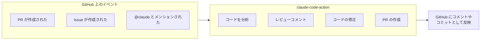

# 2-3-8 GitHub Actions

## 🎯 このセクションで学ぶこと

- Claude Code を GitHub Actions に統合する意義と仕組みを理解する
- claude-code-action の設定方法とワークフローの構造を把握する
- cc-practice を GitHub に push し、ワークフローを設定する

まず GitHub Actions 連携の仕組みと Anthropic API の概念を理解し、次にセットアップ方法とコスト管理を学び、最後に cc-practice でワークフローを設定して PR の自動レビューを体験します。

---

## 導入: PR を出すたびに手動レビューを待つボトルネック

実務の開発フローを思い浮かべてみてください。コードを書き、PR を出し、レビュアーにレビューを依頼する。レビュアーが忙しければ、レビューが返ってくるまで数時間から丸一日かかることもあります。その間、次のタスクに着手はできますが、PR のフィードバックは停滞します。

もし、PR を出した瞬間に AI が自動でコードをレビューしてくれたらどうでしょう。明らかなバグ、セキュリティの問題、コーディング規約への違反を即座に指摘してくれたら、人間のレビュアーはより本質的な設計レベルのレビューに集中できます。

**GitHub Actions** との統合により、Claude Code を CI/CD パイプラインに組み込めます。PR の自動レビュー、Issue からの自動実装、`@claude` メンションによる対話的な操作が可能になります。

### 🧠 先輩エンジニアはこう考える

> GitHub Actions 連携は、個人の生産性向上とチームの開発フロー改善の両方に効く。特に小規模チームや1人で開発している Pro生 にとっては、「レビュアーがいない問題」を部分的に解決できる。ただし、AI レビューは人間のレビューの代替ではなく補完だということは忘れないでほしい。ロジックの妥当性やビジネス要件との整合性は、依然として人間が判断すべきだ。AI レビューで機械的なチェックを済ませ、人間のレビューをより価値の高い議論に集中させる、という使い分けが理想的だ。

---

## GitHub Actions 連携とは

GitHub Actions は、GitHub のリポジトリでイベント（PR の作成、Issue の作成、コメントの投稿など）が発生したときに、自動的に処理を実行する仕組みです。Claude Code はこの仕組みに **claude-code-action** というアクションとして統合されています。



### claude-code-action でできること

| 機能 | 説明 | トリガー |
|---|---|---|
| **PR の自動レビュー** | PR が作成されたときに自動でコードレビューを行う | PR 作成時 |
| **Issue からの自動実装** | Issue の内容をもとにコードを実装し、PR を作成する | Issue 作成時 |
| **@claude メンション** | PR や Issue のコメントで `@claude` と書くと応答する | コメント投稿時 |
| **コミットの自動生成** | 指摘に基づいてコードを修正し、コミットを追加する | @claude の指示 |

## Anthropic API とは

ここで重要な概念を1つ学ぶ必要があります。

これまであなたが使ってきた Claude Code は、**Claude.ai のアカウント**（Pro または Max プラン）で動作しています。月額固定料金で、ターミナルから Claude Code を直接操作するスタイルです。

GitHub Actions で Claude Code を使う場合は、**Anthropic API** を使います。これはプログラムから Claude にアクセスするための仕組みで、**従量課金**（使った分だけ料金が発生する）です。

| | Claude.ai（Pro / Max） | Anthropic API |
|---|---|---|
| **用途** | ターミナルからの対話的な利用 | プログラム（GitHub Actions 含む）からの利用 |
| **料金体系** | 月額固定（2026年3月時点: Pro $20/月、Max $100〜$200/月） | 従量課金（トークン数に応じた料金） |
| **認証** | ブラウザでのログイン | API キー |
| **アカウント** | Claude.ai | Anthropic Console |

> ⚠️ **費用に関する重要な注意**: GitHub Actions で claude-code-action を使うと、ワークフローが実行されるたびに Anthropic API の利用料金が発生します。料金はタスクの複雑さ（消費トークン数）によって変わります。学習目的の小規模な PR レビュー（`--max-turns 5`、Sonnet モデル）であれば、1回あたり $0.01〜$0.10 程度に収まることがほとんどです。ただし、意図しない大量実行を防ぐため、`max-turns` の設定やワークフローのタイムアウトを適切に設定してください。

### Anthropic Console と API キーの取得

GitHub Actions で claude-code-action を使うには、Anthropic API の API キーが必要です。

1. [Anthropic Console](https://console.anthropic.com/) にアクセスする
2. アカウントを作成する（Claude.ai のアカウントとは別です）
3. クレジットカードを登録する（従量課金のため）
4. API キーを発行する

> 📝 Anthropic Console は2026年3月時点で初回登録時に無料クレジットが付与される場合があります。学習目的であれば少額の利用で十分に試せます。最新の料金体系と無料枠の情報は Anthropic Console の公式サイトで確認してください。

## セットアップ方法

GitHub Actions 連携のセットアップには2つの方法があります。

### 方法1: Claude Code から自動セットアップ（推奨）

最も簡単な方法です。Claude Code を起動した状態で、スラッシュコマンドを実行します。

```
> /install-github-app
```

Claude Code が対話的にセットアップを案内します。GitHub App のインストール、API キーの設定、ワークフローファイルの作成まで一括で行えます。

### 方法2: 手動セットアップ

手動でセットアップする場合は、以下の3ステップで進めます。

**Step 1: Claude GitHub App をインストールする**

[Claude GitHub App](https://github.com/apps/claude) をリポジトリにインストールします。

**Step 2: API キーをリポジトリの Secrets に追加する**

GitHub リポジトリの Settings > Secrets and variables > Actions で、`ANTHROPIC_API_KEY` として API キーを登録します。

> ⚠️ API キーは絶対にコードにハードコーディングしないでください。必ず GitHub Secrets を使って管理します。

**Step 3: ワークフローファイルを作成する**

`.github/workflows/claude.yml` を作成します。

## ワークフローファイルの構造

GitHub Actions のワークフローファイルは YAML 形式で記述します。claude-code-action の基本構成を見てみましょう。

```yaml
# .github/workflows/claude.yml
name: Claude Code

on:
  issue_comment:
    types: [created]
  pull_request_review_comment:
    types: [created]
  issues:
    types: [opened, assigned]
  pull_request:
    types: [opened, synchronize]

jobs:
  claude:
    if: |
      (github.event_name == 'issue_comment' && contains(github.event.comment.body, '@claude')) ||
      (github.event_name == 'pull_request_review_comment' && contains(github.event.comment.body, '@claude')) ||
      (github.event_name == 'issues' && contains(github.event.issue.body, '@claude')) ||
      (github.event_name == 'pull_request')
    runs-on: ubuntu-latest
    permissions:
      contents: write
      pull-requests: write
      issues: write
    steps:
      - uses: anthropics/claude-code-action@v1
        with:
          anthropic_api_key: ${{ secrets.ANTHROPIC_API_KEY }}
```

このワークフローは、以下のイベントで claude-code-action を起動します。

| イベント | 条件 | 動作 |
|---|---|---|
| PR が作成された | 常に | 自動レビュー |
| PR にコメントが投稿された | `@claude` を含む | メンションに応答 |
| Issue が作成された | `@claude` を含む | Issue の対応 |
| Issue にコメントが投稿された | `@claude` を含む | メンションに応答 |

### カスタマイズ

claude-code-action は `with` フィールドでカスタマイズできます。

```yaml
- uses: anthropics/claude-code-action@v1
  with:
    anthropic_api_key: ${{ secrets.ANTHROPIC_API_KEY }}
    prompt: "日本語でレビューしてください"
    claude_args: "--max-turns 5 --model claude-sonnet-4-6"
```

| パラメータ | 説明 |
|---|---|
| `prompt` | Claude に渡す追加の指示 |
| `claude_args` | Claude Code の CLI 引数（`--max-turns`、`--model` など） |

> 💡 `--max-turns` はコスト管理に重要です。この値を制限することで、1回のワークフロー実行での API 利用量を抑えられます。学習段階では `5` 程度に設定しておくことをおすすめします。

### CLAUDE.md との連携

ワークフロー内の Claude Code は、リポジトリの CLAUDE.md を読み込みます。つまり、CLAUDE.md にプロジェクトのコーディング規約や設計方針を書いておけば、GitHub Actions のレビューでもその規約に沿った指摘が行われます。

```markdown
<!-- CLAUDE.md に以下のような記述を追加 -->
## コードレビュー基準
- PSR-12 に準拠すること
- N+1 クエリを避けること
- 認証・認可のチェックを必ず含めること
```

## コストと安全性の管理

GitHub Actions で claude-code-action を使う際には、コストとセキュリティの管理が重要です。

### コスト管理

| 対策 | 方法 |
|---|---|
| **max-turns の制限** | `claude_args: "--max-turns 5"` で1回の実行を制限 |
| **ワークフローのタイムアウト** | `timeout-minutes: 30` でジョブの最大実行時間を設定 |
| **トリガーの限定** | `if` 条件で不要なトリガーを除外 |
| **モデルの選択** | Sonnet（低コスト）を使う：`claude_args: "--model claude-sonnet-4-6"` |

### セキュリティ

| 対策 | 方法 |
|---|---|
| **API キーの管理** | 必ず GitHub Secrets を使う。コードにハードコーディングしない |
| **権限の最小化** | `permissions` で必要最小限の権限のみ付与する |
| **レビューの確認** | Claude の提案を鵜呑みにせず、マージ前に人間が確認する |

---

## 🏃 実践: cc-practice にワークフローを設定する

cc-practice プロジェクトを GitHub に push し、claude-code-action のワークフローを設定してみましょう。

> 📌 この実践には以下が必要です。
> - GitHub アカウント
> - Anthropic Console のアカウントと API キー
> - `gh` コマンド（GitHub CLI）がインストール・認証済みであること（前のセクション 2-3-7 で準備）
>
> Anthropic API は **従量課金** です。この実践で少額の費用が発生する可能性があります。

### Step 1: GitHub リポジトリを作成して push する

Claude Code を起動し、以下のように指示します。

```
> gh コマンドで cc-practice の GitHub リポジトリを作成して push して。リポジトリは Private で
```

Claude Code が `gh repo create` と `git push` を実行します。

> ⚠️ **よくあるエラー**: `gh: command not found`
>
> ```
> zsh: command not found: gh
> ```
>
> **原因**: GitHub CLI がインストールされていません。
>
> **対処法**: 前のセクション（2-3-7）の「GitHub CLI（gh）との連携」の手順に沿って、インストールと認証を行ってください。

### Step 2: API キーを Secrets に登録する

Anthropic Console で API キーを取得し、GitHub リポジトリの Secrets に登録します。Claude Code 上で以下を実行します。

```
> ! gh secret set ANTHROPIC_API_KEY
```

プロンプトが表示されたら、Anthropic Console で発行した API キーを貼り付けます。

> 📝 `!` プレフィックスを付けると、Claude Code 内からターミナルコマンドを直接実行できます（2-1-1 で学習）。

### Step 3: ワークフローファイルを作成する

Claude Code にワークフローファイルの作成を依頼します。

```
> .github/workflows/claude.yml を作成して。
> claude-code-action v1 を使い、PR 作成時と @claude メンション時に動作するようにして。
> max-turns は 5、モデルは claude-sonnet-4-6 を指定して。
> 日本語でレビューするように prompt を設定して
```

Claude Code がワークフローファイルを作成します。あなたの環境では異なる内容が生成されますが、以下のような構造になっているはずです。

<details>
<summary>生成されたワークフローファイルの全文を確認する（クリックで展開）</summary>

```yaml
name: Claude Code

on:
  issue_comment:
    types: [created]
  pull_request_review_comment:
    types: [created]
  issues:
    types: [opened, assigned]
  pull_request:
    types: [opened, synchronize]

jobs:
  claude:
    if: |
      (github.event_name == 'issue_comment' && contains(github.event.comment.body, '@claude')) ||
      (github.event_name == 'pull_request_review_comment' && contains(github.event.comment.body, '@claude')) ||
      (github.event_name == 'issues' && contains(github.event.issue.body, '@claude')) ||
      (github.event_name == 'pull_request')
    runs-on: ubuntu-latest
    timeout-minutes: 30
    permissions:
      contents: write
      pull-requests: write
      issues: write
    steps:
      - uses: anthropics/claude-code-action@v1
        with:
          anthropic_api_key: ${{ secrets.ANTHROPIC_API_KEY }}
          prompt: "日本語でレビューしてください。セキュリティ、パフォーマンス、可読性の観点でチェックしてください。"
          claude_args: "--max-turns 5 --model claude-sonnet-4-6"
```

</details>

### Step 4: ワークフローをコミットして push する

```
> 作成したワークフローファイルをコミットして push して。コミットメッセージは「GitHub Actions で Claude Code レビューを設定」で
```

### Step 5: PR を作成して動作を確認する

ワークフローの動作を確認するため、cc-practice に簡単な変更を加えた PR を作成します。

```
> 新しいブランチ test/claude-review を作成して、app/Http/Controllers/DailyReportController.php の index メソッドにコメントを追加して、PR を作成して
```

PR が作成されると、GitHub Actions が自動的に claude-code-action を実行します。しばらく待つと、PR にレビューコメントが投稿されます。

GitHub の PR ページを開いて、Claude からのレビューコメントを確認してみましょう。

<!-- TODO: 画像追加 - GitHub PR 上の Claude レビューコメント -->

### Step 6: レビュー結果を確認する

Claude がどのような観点でレビューしたかを確認してください。ワークフローで指定した「セキュリティ、パフォーマンス、可読性」の観点が反映されているはずです。

> 💡 ワークフローの実行状況は、GitHub リポジトリの「Actions」タブで確認できます。実行にかかった時間や、使用したトークン量も確認できます。

> 📝 PR のレビューが完了したら、テスト用のブランチとPRはクローズして構いません。これで cc-practice に GitHub Actions ワークフローが設定された状態になりました。

---

## 🔍 見極めチェック

> 🧠 先輩エンジニアの思考: 「GitHub Actions は push したら即座に動く。設定ミスがあると、意図しない API 呼び出しでコストが膨らむ可能性がある。特に `if` 条件と `max-turns` は慎重に確認する。」

- [ ] **正しさ**: YAML の構文が正しいか。`on` のトリガー条件と `if` のフィルタ条件が意図通りか
- [ ] **品質**: `--max-turns` と `timeout-minutes` が設定されているか。不要なトリガーが含まれていないか
- [ ] **安全性**: API キーが GitHub Secrets で管理されているか（ハードコーディングされていないか）。`permissions` が必要最小限か

> 🔑 この Section では特に「コスト管理の設定（max-turns、timeout）」に注目してください。

---

## ✨ まとめ

- **claude-code-action** は Claude Code を GitHub Actions に統合するアクションで、PR の自動レビュー、Issue からの自動実装、`@claude` メンションが可能
- GitHub Actions 連携には **Anthropic API**（従量課金）が必要。Claude.ai のアカウントとは別のもの
- ワークフローファイル（`.github/workflows/claude.yml`）で動作を定義する
- `--max-turns`、`timeout-minutes`、モデル選択でコストを管理する
- API キーは必ず GitHub Secrets で管理し、コードにハードコーディングしない
- CLAUDE.md にコーディング規約を書いておくと、AI レビューにも反映される

---

これで Part 2 は完了です。セットアップから始まり、エージェントループやコンテキスト管理の基本を理解し、Plan Mode、Skills、Hooks、MCP、Sub-agents、Plugins、Git 連携、GitHub Actions という Claude Code の主要機能を一通り学びました。次の Part 3 では、提供プロジェクトを使い、ここで学んだ機能を実務タスク（バグ修正・機能開発・リファクタリング）で総合的に実践していきます。
