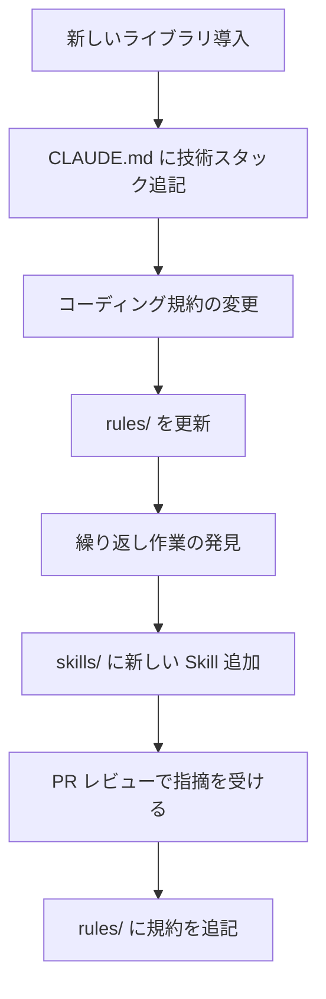

# 3-6-1 AI 時代のチーム開発

## 🎯 このセクションで学ぶこと

- AI 生成コードに対する「説明責任」の意味と、コミットした人が全責任を負う原則を理解する
- AI がチームのレビュープロセスに与える影響と、その対策を理解する
- attribution 設定による帰属表示の意味と、チームでの方針決定の必要性を理解する
- CLAUDE.md・rules・skills がチームの「新しい成果物」であることを理解する

まず説明責任の考え方を理解し、次にレビューの変化と対策を学び、最後にチーム全体で AI を活用するための仕組みを見ていきます。

---

## 導入: 「動くコードを書いた」で終わり？

Part 3 を通じて、あなたは Claude Code と協働して多くのコードを書いてきました。バグを修正し、機能を追加し、リファクタリングで品質を改善しました。見極めチェックで正しさ・品質・安全性を検証し、テストも通しました。

しかし、実務ではここからが本番です。

書いたコードはチームメンバーにレビューされ、承認を得て、マージされて初めて価値を持ちます。そのとき、レビュアーから「この実装、なぜこの方法にしたの？」と聞かれたらどう答えますか？「Claude Code が提案したので」は答えになりません。

この Chapter では、**AI 生成コードをチームに届けるときに必要な責任と仕組み** を学びます。

### 🧠 先輩エンジニアはこう考える

> AI ツールを使い始めて、コードを書くスピードは格段に上がった。でも、PR を出すまでの時間はそこまで変わらなかった。なぜかというと、「このコードを自信を持って説明できるか」を確認する時間が必要だから。特に認可まわりやデータの整合性に関わる部分は、AI が生成したコードを一行ずつ追って「なぜこうなっているか」を自分の言葉で説明できるまで PR を出さない。それが結果的にレビューをスムーズにして、手戻りを減らしている。

---

## 説明責任: コミットした人が全責任を負う

### 「AI が書いた」は言い訳にならない

AI 生成コードに対する最も重要な原則は、**コミットした人がそのコードの全責任を負う** ということです。

これは AI ツールが登場する前から変わらない原則です。Stack Overflow からコピーしたコードも、同僚が書いたコードをマージしたときも、責任はコミットした本人にあります。AI 生成コードも同じです。

GitHub の公式ブログ記事「[Code Review in the Age of AI](https://github.blog/ai-and-ml/generative-ai/code-review-in-the-age-of-ai-why-developers-will-always-own-the-merge-button/)」でも、「AI and ML の時代においても、開発者がマージボタンを押す責任者であることは変わらない」と明確に述べられています。

なぜこの原則が AI 時代に特に重要なのでしょうか。それは、AI が生成するコードの量と速度が、人間が手で書くコードとは桁違いだからです。

Checkmarx の 2025 年調査（「[CISO Guide to Securing AI-Generated Code](https://checkmarx.com/blog/ai-is-writing-your-code-whos-keeping-it-secure/)」）によると、AI が生成した PR は人間が書いた PR と比較して以下の特徴があります。

- セキュリティ問題が **1.57 倍** 多い
- XSS（クロスサイトスクリプティング）脆弱性が **2.74 倍** 多い
- 安全でないオブジェクト参照が **1.91 倍** 多い

AI は大量のコードを高速に生成できますが、その分だけ問題も含まれやすいのです。だからこそ、コミットする前に自分で検証する必要があります。

> 📝 Part 3 で毎回実践してきた「見極めチェック」（正しさ・品質・安全性の3観点での検証）は、まさにこの説明責任を果たすための行動です。「テストが通っている」「規約に従っている」「認可が正しい」と自分で確認したからこそ、自信を持ってコミットできます。

### 「このコードを説明できるか」テスト

AI 生成コードをコミットする前に、自分自身に問いかけてください。

**「このコードが何をしていて、なぜこの実装にしたのか、レビュアーに説明できるか？」**

Addy Osmani 氏は次のように述べています。「あなたの名前でコードを提出するなら、そのコードに責任を持つ。だから、レビューしていることを確認する必要がある」（「[The 70% Problem: Hard Truths about AI-Assisted Coding](https://addyo.substack.com/p/the-70-problem-hard-truths-about)」より）。

具体的には、以下の観点で説明できるかを確認します。

- **何をしているか**: コードの動作を自分の言葉で説明できる
- **なぜこの方法か**: 他の選択肢（例: Service クラスの導入）を検討した上で、この方法を選んだ理由を説明できる
- **どう検証したか**: テストで何を確認し、見極めチェックで何を検証したかを説明できる
- **影響範囲はどこか**: この変更が他のどの機能に影響する可能性があるかを説明できる

Part 3 で実践してきたことを振り返ると、これらの観点はすべてカバーしています。

| 観点 | Part 3 での実践 |
|---|---|
| 何をしているか | コードリーディング（3-2）で既存コードを理解し、修正内容を把握した |
| なぜこの方法か | 規約との照合（[3-1-3 プロジェクトの規約・設定を確認する](../chapter-01_実践の準備/3-1-3_プロジェクトの規約・設定を確認する.md)）、過剰な提案の判断（[3-5-2 CourseHubのコードを改善する](../chapter-05_コードを改善する/3-5-2_CourseHubのコードを改善する.md) の Service 層見送り） |
| どう検証したか | 見極めチェック（毎 Section）、テスト実行（`/test`） |
| 影響範囲はどこか | 修正後の影響範囲の確認（[3-3-1 バグ修正の方法論](../chapter-03_バグを修正する/3-3-1_バグ修正の方法論.md)）、テストによる動作保証（3-5） |

つまり、Part 3 で身につけた「見極める力」は、そのまま説明責任を果たす力です。

> ⚠️ **「Vibe Coding」の危険性**: AI の出力をよく理解せずにそのまま受け入れるコーディングスタイルは「Vibe Coding」（Andrej Karpathy 氏の造語）と呼ばれます。個人のプロトタイピングでは有効な場面もありますが、チーム開発では深刻な問題を引き起こします。Retool の調査記事（「[The Risks of Vibe Coding](https://retool.com/blog/vibe-coding-risks)」）では、AI が生成した SaaS アプリケーションでペイウォールが CSS の数行で回避できる状態になっていた事例が報告されています。説明できないコードはコミットしないでください。

---

## AI がレビューに与える影響と対策

### コード生成量の増加がレビューのボトルネックを生む

AI ツールの導入により、開発者のコード生成量は大幅に増加しました。Faros AI の 2025 年調査（「[The AI Productivity Paradox](https://www.faros.ai/blog/ai-software-engineering)」）によると、AI を積極的に活用しているチームでは **PR の量が 98% 増加** した一方で、**PR のレビュー時間は 91% 増加** しています。

つまり、AI でコードを書くスピードは上がったものの、レビューのスピードは追いついていないのです。

Addy Osmani 氏の「70% Problem」を思い出してください（[3-1-1](../chapter-01_実践の準備/3-1-1_Claude%20Codeで実務タスクを遂行する考え方.md) で学習）。AI はルーティンワークの 70% を処理できますが、残りの 30%（エッジケース、セキュリティ、本番環境との統合）は人間の判断が必要です。レビューはまさにこの 30% に該当します。

```
AI 導入前:
  コード作成（遅い）→ レビュー → マージ
                      ↑ ここが律速ではなかった

AI 導入後:
  コード作成（速い）→ レビュー → マージ
                      ↑ ここが律速になった
```

### レビュー負荷を下げるために「あなた」ができること

レビューのボトルネックはチーム全体の問題ですが、PR を出す側（あなた）にもできることがあります。

**1. PR を出す前に自己レビューする**

Claude Code は PR を出す前の自己レビューにも活用できます。

```
> このブランチの変更を全てレビューしてください。
> 以下の観点で問題がないか確認してください:
> - rules/coding.md のコーディング規約に従っているか
> - テストが十分か
> - セキュリティ上の問題がないか
```

自分で見極めチェックを行い、さらに Claude Code に自己レビューさせることで、レビュアーに届く前に多くの問題を解消できます。レビュアーは「AI が見落としがちな設計判断」や「ビジネスロジックの妥当性」に集中できます。

**2. PR の説明を充実させる**

レビュアーが最も時間を使うのは「この変更が何を意図しているか」を理解するフェーズです。PR の本文に以下を明記すると、レビュー時間を大幅に短縮できます。

- **変更の目的**: なぜこの変更が必要か（バグ報告、要件、技術的負債）
- **変更のアプローチ**: なぜこの方法を選んだか（検討した代替案があれば記載）
- **検証内容**: どうテストしたか、見極めチェックで何を確認したか
- **影響範囲**: この変更が他のどの機能に影響するか

**3. PR を小さく保つ**

1つの PR に複数の変更を詰め込まないでください。バグ修正とリファクタリングを同じ PR に含めると、レビュアーは「何がバグ修正で何がリファクタリングか」を判別する負荷が増えます。[3-3-1 バグ修正の方法論](../chapter-03_バグを修正する/3-3-1_バグ修正の方法論.md) で学んだ「バグ修正とリファクタリングはコミットを分ける」原則は、PR にもそのまま当てはまります。

### 🧠 先輩エンジニアはこう考える

> レビュー依頼を受けたとき、一番ありがたいのは「PR の説明が充実している」こと。逆に一番困るのは、500 行の差分があるのに説明が一行だけの PR。AI で大量のコードを生成できるようになった分、PR の説明に力を入れてほしい。「何を変えたか」はコードを見ればわかるけど、「なぜこう変えたか」は説明がないとわからない。

---

## 帰属表示: attribution 設定とチームの方針

### デフォルトの帰属表示

Claude Code でコミットを作成すると、デフォルトでコミットメッセージに以下のような帰属表示が追加されます。

```
🤖 Generated with Claude Code

Co-Authored-By: Claude <noreply@anthropic.com>
```

この帰属表示は、**AI がコード生成に関与したことを透明にする** ためのものです。将来コードを読む人が「このコミットは AI の支援を受けて書かれた」と認識できます。

`Co-Authored-By` は Git の慣習で、複数の人が共同で書いたコミットに使われるトレーラー（コミットメッセージ末尾の付加情報）です。GitHub はこのトレーラーを認識し、コミット画面に共著者のアバターを表示します。

### 帰属表示の設定

Claude Code では `attribution` 設定で帰属表示の内容を制御できます。

```json
{
  "attribution": {
    "commit": "🤖 Generated with Claude Code",
    "pr": ""
  }
}
```

- `commit`: コミットメッセージに追加するテキスト。空文字 `""` にすると非表示
- `pr`: PR の説明に追加するテキスト。空文字 `""` にすると非表示

任意のテキストを設定できるため、チームの方針に合わせてカスタマイズできます。たとえば `Co-Authored-By` を外して絵文字行だけにしたり、逆に絵文字行を外して `Co-Authored-By` だけにすることも可能です。

この設定は `.claude/settings.json`（チーム共有）または `.claude/settings.local.json`（個人設定）に記述できます。

### チームで方針を決める

帰属表示については、業界でまだ標準が確立されていません。チームで方針を決める必要があります。

| 方針 | メリット | デメリット |
|---|---|---|
| 常に付ける（デフォルト） | AI 利用の透明性が確保される | コミットメッセージが長くなる |
| 付けない（`""` に設定） | コミット履歴がシンプル | AI 利用の追跡ができない |
| PR のみに付ける | コミットは簡潔に、PR で透明性を確保 | コミット単位では AI 利用がわからない |

> 💡 大切なのは「チーム全員が同じルールに従う」ことです。個人の判断でバラバラにするのではなく、チームで議論して方針を決め、`.claude/settings.json` に設定を反映しましょう。帰属表示の有無に関わらず、**説明責任はコミットした本人にある** ことは変わりません。

Bence Ferdinandy 氏は「[Don't abuse Co-authored-by for marking AI assistance](https://bence.ferdinandy.com/2025/12/29/dont-abuse-co-authored-by-for-marking-ai-assistance/)」で、「`Co-Authored-By` は本来、人間の共同作業者のための Git 慣習であり、ツールに使うのは適切でない」と主張しています。一方で、[SSW Rules](https://www.ssw.com.au/rules/attribute-ai-assisted-commits-with-co-authors)（オーストラリアのソフトウェアコンサルティング企業の開発規約集）では AI アシスタントの帰属表示を推奨しています。どちらの立場にも理があり、チームの文化や要件に合わせて判断してください。

---

## CLAUDE.md・rules・skills はチームの「新しい成果物」

### コードだけでなく「AI への指示」も共有する

Part 3 を通じて、あなたは CourseHub の CLAUDE.md を更新し、rules を整備し、skills を修正してきました（[3-1-3](../chapter-01_実践の準備/3-1-3_プロジェクトの規約・設定を確認する.md)）。これらのファイルは単なる設定ではありません。**チームの知識を AI に伝えるための成果物** です。

従来のチーム開発で共有される成果物を振り返りましょう。

- **コード**: アプリケーションの実装
- **テスト**: 動作の仕様書
- **ドキュメント**: README、API 仕様書、設計書
- **CI/CD 設定**: ビルド・デプロイの自動化

AI 時代には、ここに新しい成果物が加わります。

- **CLAUDE.md**: プロジェクトの概要・方針・コマンド体系を AI に伝える
- **.claude/rules/**: コーディング規約や設計方針を AI に伝える
- **.claude/skills/**: 繰り返し行うワークフローを AI に伝える
- **.claude/settings.json**: AI の権限と動作設定をチームで統一する

これらをチームで管理することで、**誰が Claude Code を使っても、同じ規約に従い、同じワークフローで作業できる** 状態を作れます。

### Project scope と User/Local scope の使い分け

[2-1-2 権限とセキュリティ](../../part-02_Claude%20Codeの基礎/chapter-01_セットアップ/2-1-2_権限とセキュリティ.md) で学んだ通り、Claude Code の設定にはスコープがあります。チーム共有の観点では、以下のように使い分けます。

| スコープ | ファイル | Git 管理 | 用途 |
|---|---|---|---|
| Project | `.claude/settings.json` | する | チーム全員に適用する権限・Hooks・MCP 設定 |
| Local | `.claude/settings.local.json` | しない（.gitignore） | 個人の追加権限・ローカル環境固有の設定 |
| User | `~/.claude/settings.json` | しない | 全プロジェクト共通の個人設定 |

**Project scope に入れるもの**:

- Sail コマンドの許可（`Bash(./vendor/bin/sail *)`）
- Git コマンドの許可（`Bash(git add *)`, `Bash(git commit *)` 等）
- Hooks の設定（コミット前の自動フォーマット等）
- 帰属表示の方針（`attribution`）

**Local scope に入れるもの**:

- 個人のディレクトリパスに依存する設定（`Read(/Users/yourname/**)`）
- 個人の作業スタイルに関する設定

> 💡 `.claude/settings.local.json` は `.gitignore` に含まれるため、Git には追跡されません。個人の環境固有の設定はここに書くことで、チームの設定を汚さずに済みます。

### CLAUDE.md は「生きたドキュメント」

CLAUDE.md はプロジェクトの進行とともに更新されるべきものです。新しいライブラリを導入したとき、コーディング規約を変更したとき、新しいコマンド体系が加わったときに更新します。



コードと同じく、CLAUDE.md や rules の変更も PR でレビューを受けてマージするのが理想です。「AI への指示」もチームの合意で管理する文化を作りましょう。

---

## ✨ まとめ

- **説明責任**: AI 生成コードに対する全責任はコミットした人が負う。「AI が書いた」は言い訳にならない
- **「説明できるか」テスト**: コミット前に「何をしているか」「なぜこの方法か」「どう検証したか」「影響範囲はどこか」を自分の言葉で説明できるか確認する。Part 3 で実践してきた見極めチェックがそのまま説明責任を果たす力になる
- **レビュー負荷の対策**: AI でコード生成量が増えた分、PR を出す前の自己レビュー、充実した PR 説明、小さな PR の3つでレビュアーの負荷を下げる
- **帰属表示**: 帰属表示（`attribution`）の方針はチームで統一する。`attribution` 設定の `commit` / `pr` で内容をカスタマイズ可能。帰属表示の有無に関わらず説明責任は変わらない
- **チームの新しい成果物**: CLAUDE.md・rules・skills・settings.json はコードと同じくチームで管理する成果物。Project scope と Local scope を使い分け、チーム全員が同じ環境で作業できる状態を作る

---

次のセクションでは、これらの考え方を実践します。CourseHub での変更を PR にまとめ、GitHub Actions を設定し、ワークフローを Skill 化してチームに届けます。
