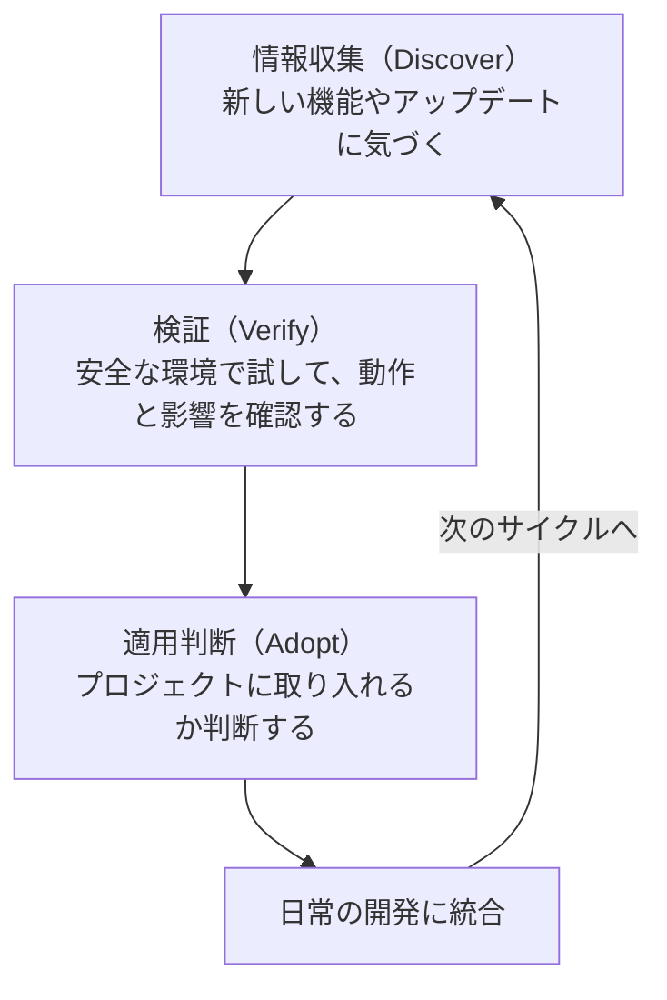

# 4-1-1 学び続けるサイクル

> Claude Code と AI ツールの進化に追従し続ける方法を理解し、教材で学んだことを振り返り、さらに先の活用領域を知る Chapter です。Part 3 で鍛えた「使いこなす力」と「見極める力」に、最後のピース「学び続ける力」を加えて、教材の締めくくりとします。

| セクション | 種類 | 内容 |
|---|---|---|
| 4-1-1 | 概念 | 情報収集・検証・適用判断の学習サイクルを理解する |
| 4-1-2 | 概念 | 教材全体の振り返りと、ここから先の成長の道筋 |
| 4-1-3 | 概念 | 教材で深く扱わなかった発展機能の全体像 |

## 📖 この Chapter の進め方

Pro生のあなたは、Part 2・3 を通じて Claude Code の基礎と実践を学んできました。Part 4 はハンズオンのない読み物パートです。Part 3 までの実践を振り返りながら、「これから先、どうやって学び続けるか」を考えるための Chapter です。

4-1-1 で学び続けるための具体的なサイクルを学び、4-1-2 で教材全体を振り返り、4-1-3 でまだ知らない機能に触れます。順番に読み進めてください。

---

## 🎯 このセクションで学ぶこと

- Claude Code が進化し続けるツールであることを理解する
- 情報収集→検証→適用判断の3ステップサイクルを身につける
- CLAUDE.md やプロジェクト設定を定期的に見直す習慣を作る

まず Claude Code の進化の速さを実感し、次に学び続けるための具体的なサイクルを学び、最後にそのサイクルをプロジェクトに組み込む方法を確認します。

---

## 導入: 今日学んだことが、来週には変わっている

### 🧠 先輩エンジニアはこう考える

> この教材を書いている間にも、Claude Code は何度もアップデートされた。新しい機能が追加されたり、既存の機能の挙動が変わったり、非推奨になった機能もある。AI ツールに限らず、Web 開発の技術は常に変化している。Laravel だって数ヶ月ごとにマイナーバージョンが上がり、年に一度メジャーバージョンが出る。大事なのは「すべてを追いかける」ことではなく、「変化に気づき、必要なものを取り入れる仕組み」を持つこと。

---

## Claude Code はどれくらい速く進化するのか

Claude Code の [Changelog](https://code.claude.com/docs/en/changelog) を見ると、その進化の速さがわかります。2026年3月時点で、1週間に複数回のアップデートがリリースされています。各リリースには新機能の追加、既存機能の改善、バグ修正、セキュリティ修正が含まれます。

> 📝 以下は説明のためのイメージです。実際の内容は [Changelog](https://code.claude.com/docs/en/changelog) で確認してください。

```
2.1.83 (March 25, 2026)
  Added: ...
  Fixed: ...
  Improved: ...

2.1.81 (March 20, 2026)
  Added: ...
  Fixed: ...

2.1.80 (March 19, 2026)
  Added: ...
  Changed: ...
```

この教材で学んだ機能も、バージョンアップによって挙動が変わったり、より便利な使い方ができるようになる可能性があります。たとえば、Part 2 で学んだ Plan Mode、Skills、Hooks、MCP といった機能も、リリースを重ねるごとに改善されています。

> 📝 Claude Code はネイティブインストール（curl / Homebrew / WinGet）の場合、自動アップデートが有効です（Settings の `autoUpdaterEnabled` で制御）。npm インストールの場合は手動で `npm update -g @anthropic-ai/claude-code` を実行する必要があります。

この速さは、裏を返せば「一度学んで終わり」では不十分だということを意味します。Part 1 で紹介した3つの能力のうち「学び続ける力」が必要な理由がここにあります。

---

## 学び続けるサイクル: 情報収集→検証→適用判断

変化に追従するための具体的なサイクルを紹介します。このサイクルは Claude Code に限らず、あらゆる開発ツールや技術の学習に応用できます。



### Step 1: 情報収集（Discover）

「何が変わったのか」に気づくための情報源を押さえておきます。

**公式の情報源**

| 情報源 | URL | 特徴 |
|---|---|---|
| Changelog | https://code.claude.com/docs/en/changelog | バージョンごとの変更点。最も正確 |
| 公式ドキュメント | https://code.claude.com/docs/en/ | 機能の使い方。新機能追加時に更新される |
| Anthropic Blog | https://www.anthropic.com/blog | 大きな機能リリースの背景や活用事例 |

**コミュニティの情報源**

| 情報源 | 特徴 |
|---|---|
| GitHub Discussions (anthropics/claude-code) | バグ報告、機能リクエスト、使い方の議論 |
| X (Twitter) のハッシュタグ | 実践的な Tips やワークフローの共有 |
| 技術ブログ・Zenn・Qiita | 日本語での活用事例や解説 |

> 💡 すべての情報源を毎日チェックする必要はありません。**Changelog を週に1回確認する** だけでも、主要な変更を把握できます。大きなリリースは Anthropic Blog や X で話題になるため、自然と目に入ります。

**Claude Code 自身に聞く方法**

Claude Code に直接アップデート内容を確認することもできます。

```
> Claude Code の最近のアップデートで追加された新機能を教えてください。
> 特に、この教材で学んだ Plan Mode や Skills に関する変更があれば詳しく知りたいです。
```

Claude Code は自身の機能について回答できますが、最新の Changelog の詳細までは把握していない場合があります。正確な情報は公式 Changelog で確認しましょう。

### Step 2: 検証（Verify）

気になる機能やアップデートを見つけたら、いきなり実務プロジェクトで試すのではなく、安全な環境で検証します。

**検証の3つのアプローチ**

1. **使い捨てのプロジェクトで試す**: `composer create-project` で新しい Laravel プロジェクトを作成し、そこで新機能を試します。実務のコードに影響を与えずに検証できます

2. **Worktree で試す**: Part 2 で学んだ Worktree を使えば、既存プロジェクトのコードベースで新機能を試しつつ、メインブランチには影響を与えません

3. **`--bare` モードで最小検証する**: Claude Code の `--bare` フラグ（`claude -p --bare`）を使うと、CLAUDE.md、Skills、Hooks、Plugins、MCP、Auto Memory を読み込まずに起動できます。新機能の動作だけを確認したい場合に便利です

```bash
# 使い捨てプロジェクトでの検証例
mkdir test-new-feature && cd test-new-feature
git init
claude
```

> ⚠️ **よくある失敗**: 新機能を見つけてすぐに実務プロジェクトで試し、予期しない動作でコードを壊してしまうケースがあります。「面白そう」と思ったときこそ、まず安全な環境で試す習慣をつけましょう。

### Step 3: 適用判断（Adopt）

検証が終わったら、実際のプロジェクトに取り入れるかどうかを判断します。以下の3つの観点で考えます。

**安定性**: その機能はプロダクション品質か

- `Experimental`（実験的）や `Research Preview`（研究プレビュー）のラベルがついている機能は、仕様が変わる可能性があります
- 安定版の機能であっても、リリース直後はバグが含まれることがあります。急ぎでなければ1〜2週間待ってから導入するのも一つの手です

**チームへの影響**: チームメンバーに影響があるか

- `.claude/settings.json` の変更は全メンバーに影響します。新しい設定を追加する前にチームで共有しましょう
- CLAUDE.md に新機能を前提とした指示を追加すると、古いバージョンの Claude Code を使っているメンバーに問題が起きる可能性があります

**コストとメリット**: 導入に見合う価値があるか

- 新機能を導入するためにプロジェクト設定の大幅な変更が必要な場合、そのコストに見合うメリットがあるかを考えます
- 「便利そう」だけで導入すると、設定の複雑さが増してメンテナンスが大変になります

> 🔑 適用判断は Part 3 の見極めチェックと同じ考え方です。「正しさ・品質・安全性」の3観点は、コードだけでなく、ツールや設定の導入判断にも応用できます。

---

## サイクルをプロジェクトに組み込む

学び続けるサイクルを「たまにやること」ではなく「日常の一部」にする方法を紹介します。

### CLAUDE.md の定期見直し

3-6-1 で学んだ通り、CLAUDE.md は「生きたドキュメント」です。プロジェクトが進むにつれて、Claude Code への指示もアップデートが必要になります。

見直しのきっかけとなるタイミングがあります。

- **Claude Code のメジャーアップデート時**: 新しい設定項目や非推奨になった設定がないか確認
- **新しいライブラリやフレームワークを導入した時**: 技術スタック欄の更新
- **チームメンバーが増えた時**: 前提知識や作業手順の見直し
- **「Claude Code がうまく動かない」と感じた時**: 指示が古くなっている可能性

```
> CLAUDE.md を確認して、古くなっている情報や追加が必要な情報がないか教えてください。
> 特に以下の観点でチェックしてください:
> - 技術スタックのバージョンが最新か
> - コマンド体系が現在のプロジェクト構成と一致しているか
> - 非推奨になった設定や機能への参照がないか
```

### バージョンアップ時の確認チェックリスト

Claude Code がアップデートされたとき、以下を確認する習慣をつけましょう。

- [ ] Changelog で変更点を確認する
- [ ] `Deprecated`（非推奨）になった機能が、プロジェクトで使われていないか確認する
- [ ] `Changed`（挙動変更）の項目が、既存の Hooks や Skills に影響しないか確認する
- [ ] 新機能で開発フローを改善できるものがないか検討する

> 💡 このチェックリストをすべてのアップデートで実行する必要はありません。月に1回程度、または大きなアップデートがあったときに実行すれば十分です。

### 🧠 先輩エンジニアはこう考える

> 学び続けるサイクルは、完璧にやろうとしないのがコツ。毎週 Changelog を全部読むのは現実的じゃない。自分は Changelog のタイトルだけ流し読みして、気になるものだけ詳しく見るようにしている。あとは X で流れてくる情報をキャッチするくらい。大事なのは「情報を追いかける仕組み」を持っておくこと。仕組みさえあれば、忙しい時期にサボっても、余裕ができたときにすぐ追いつける。

---

## ✨ まとめ

- Claude Code は週に複数回のペースでアップデートされている。「一度学んで終わり」ではなく、変化に追従する仕組みが必要
- **情報収集→検証→適用判断** の3ステップサイクルで、新しい機能やアップデートを安全に取り入れる
- 情報収集は Changelog を中心に、コミュニティや Claude Code 自身も活用する。すべてを追う必要はなく、週1回の確認で十分
- 検証は使い捨てプロジェクトや Worktree で行い、実務プロジェクトへの影響を避ける
- 適用判断は「安定性・チームへの影響・コストとメリット」の3観点で行う。見極めチェックと同じ考え方
- CLAUDE.md の定期見直しとバージョンアップ時のチェックリストで、サイクルを日常に組み込む

---

次のセクションでは、教材全体で身につけた能力を振り返り、ここから先の成長の道筋を描きます。
